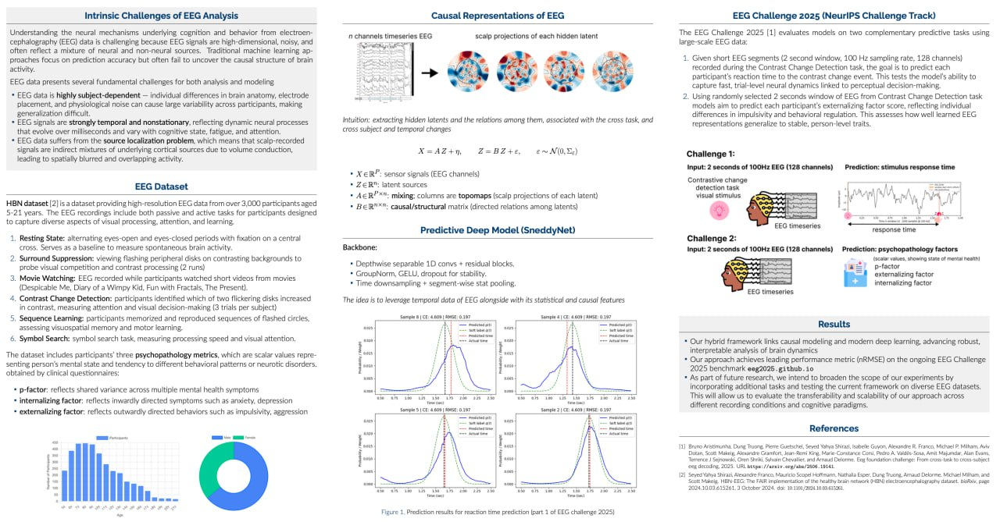
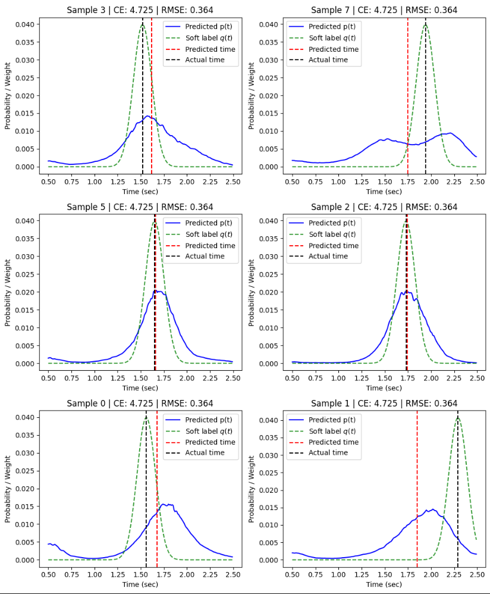

# NeuroSned – EEG Reaction-Time Modeling (Competition Track)

This repository contains the code and notebooks we used to build a winning-level solution for the **EEG Foundation Model** competition task on **reaction-time prediction**.


## Challenges at a glance
- **Challenge 1 — Reaction-time prediction (segmentation):**  
  👉 [Jump to Task 1](#challenge-1-reaction-time-prediction)
- **Challenge 2 — Externalizing factor (feature-engineered ridge):**  
  👉 [Jump to Task 2](#challenge-2-predicting-the-externalizing-factor-from-eeg)

# Challenge 1: Reaction-time prediction
## 🔑 Core ideas

- **Stimulus-locked preprocessing.** We convert run-level EEG into fixed **2-second windows** starting **0.5 s after stimulus onset**, using anchor annotations. Data are already normalized by the challenge preprocessing (100 Hz, 0.5–50 Hz band).
- **Targets as time distributions.** Instead of a single scalar, we supervise a **soft 1-D distribution** over time steps (`q`), and train the model to predict logits over time. We then compute the **expected time** `t_hat` from the distribution for RMSE.
- **Loss cocktail.** Weighted combination of **CE** on soft labels, **time RMSE**, optional **KL**, **Wasserstein-1 (CDF)** and **entropy** regularization. An optional **hazard** head converts logits to a discrete-time hazard distribution.
- **Architectures.** 1D segmentation-style models (UNet family, attention UNet, factorized UNet, Inception-style, recurrent UNet) with a unified output `(B,1,T)`.
- **Robust training.** Time-aware data augmentation (time scaling, channel dropout, cutout, Gaussian noise), **mixup** over time-bins, early stopping with **LR halving & restart from best checkpoint**.
- **Ensembling.** Average distributions / expected times across multiple architectures and seeds for best validation scores.

> **Disclaimer**  
> You can choose **any model** below for testing — all the scores mentioned in comments are **achievable using the same training code**, given enough runs and proper tuning. The provided setups represent **the most stable base configurations** for both initial training and fine-tuning modes. Exact leaderboard-level performance may require **multiple restarts and hyperparameter tweaks** for each model individually.

---

## ⚙️ Environment

Base dependencies are listed in `requirements.txt` (we do **not** hard-pin PyTorch to a specific CUDA).

```bash
# Install project requirements
pip install -r requirements.txt
```

> Notebooks assume **Python ≥ 3.10** and **PyTorch ≥ 2.3**.

---

## 📁 Data

We use the challenge-ready HBN data via `EEGChallengeDataset` (preprocessed to 100 Hz, 0.5–50 Hz).  
Set `DATA_DIR` to your data cache location (the notebooks will populate it on first run).

```
artefacts/
  data/      # pickled datasets / cached windows
  models/    # checkpoints
```

---

## ▶️ Reproduction with notebooks (run top-to-bottom)

Open in Jupyter Notebook and run sequentially; edit paths at the top where marked.

### 1. `1_data_preparation.ipynb` — annotate & window runs
- Load releases `R1..R11` with `EEGChallengeDataset` (competition preprocessing).  
- **Annotate trials** and **add stimulus anchors**.  
- **Filter late anchors** and **create 2-s windows** (start at +0.5 s).  
- Save train/valid datasets to `artefacts/data/*.pkl`.

**Edit before running:** `DATA_DIR`, `release_list`, window params (`EPOCH_LEN_S=2.0`, `SFREQ=100`).

---

### 2. `2_regression.ipynb` — direct reaction-time regression

Chronologically, we started with direct RT regression: the model predicts the reaction time as a **scalar** from a stimulus-locked 2-s EEG crop. We designed several lightweight custom models (see `models/regression`) and trained them with strong augmentations and a **two-stage schedule** (base training → fine-tuning).

- **Augmentations:** time cutout, channel dropout, Gaussian noise, time-scaling, mixup.
- **Outcome:** this setup reliably beat the baseline and briefly held **#1** on the leaderboard.
- **Limitation:** the model did not fully capture the **event-detection** nature of the task; it tended to over-focus on micro-structure rather than “*when the event happens*”.

> *Notes:* The exact leaderboard scores are attainable with these pipelines, but typically require **multiple restarts and per-model hyperparameter tuning** (LR, sigma, augmentations, schedulers, seeds).

---

### 3. `3_segmentation.ipynb` — turning RT into a segmentation problem

<p align="center">
  
</p>

To address detection explicitly, we introduced an **artificial segmentation target** over time and reframed RT prediction as **temporal segmentation** (the model outputs a distribution over time; we then take its expectation).

- **Effect:** large performance boost and faster, more stable convergence.
- **Practical benefit:** segmentation made **crop augmentations** safer/effective; the model learned *where* the event occurs.

**Losses & tricks**
- **Dataset trick:** pool of **5-second crops** → sample 2-s training windows.
- **Cross-Entropy (CE)** on soft time labels.
- **Wasserstein-1 (CDF)** to align distribution shapes.
- **Entropy** regularization for sharpness control.
- **Focal** weighting for hard time bins.
- **KL divergence** (q ‖ p) for distribution matching.
- **Hazard head:** logits → discrete-time hazard → normalized event-time distribution.

#### Inference: soft-argmax with temperature

Let logits be \(z_t\) for \(t=0,\dots,T-1\), sampling step \(\Delta t=1/\mathrm{sfreq}\),
grid \(g_t=t\,\Delta t\), and window offset \(t_0=0.5\,\mathrm{s}\).

$$
p_t(\tau)=\frac{e^{z_t/\tau}}{\sum_{k=0}^{T-1} e^{z_k/\tau}},\qquad
\hat t_{\mathrm{rel}}(\tau)=\sum_{t=0}^{T-1} p_t(\tau)\,g_t,\qquad
\hat t_{\mathrm{abs}}(\tau)=t_0+\hat t_{\mathrm{rel}}(\tau).
$$

**Temperature selection**

$$
\tau^\star = \arg\min_{\tau\in\mathcal{T}}
\ \mathrm{RMSE}_{\text{val}}\big(\hat t_{\mathrm{abs}}(\tau)\big).
$$

#### Target: segmentation label with \(\sigma\)

For true relative time \(y_{\mathrm{rel}}\in[0,\mathrm{crop\_sec}]\) we build a Gaussian label on \(g_t\):

$$
\tilde q_t=\exp\!\left(-\frac{(g_t-y_{\mathrm{rel}})^2}{2\sigma^2}\right),\qquad
q_t=\frac{\tilde q_t}{\sum_{k=0}^{T-1}\tilde q_k\,\Delta t},\qquad
\sum_{t=0}^{T-1} q_t\,\Delta t=1.
$$

This smooth label stabilizes training while preserving temporal localization.

---

### 4. `4_ensembling.ipynb` — stacking & calibration over time-distributions

**Observation.** After moving to segmentation-style outputs, each model predicts a **time distribution** (logits over T). This made ensembling more powerful (we aggregate richer signals than scalars), but also trickier: every model has its own optimal **temperature** (confidence scale). Naïve averaging over-weights overconfident models and under-weights the best but **underconfident** ones.

**Solution: out-of-fold stacking with meta-features.**  
We split validation into **5 folds** with a matched target (RT) distribution, extract features from each model’s predictions on its **OOF** split, and train a meta-model (Ridge, Gradient Boosting) to **calibrate confidence** and combine models.

**Pipeline**
1. **5-fold OOF:** for each fold, train base models on 4/5 and predict the held-out 1/5 (store logits `Z ∈ ℝ^{N×T}` or probabilities).
2. **Meta-features per model** (see `neurosned/wrappers/challenge_1/meta_features.py`):
   - **Hard peak:**  
     `t_hard = argmax(Z)·dt + win_offset`, peak score `z_max`, top-2 **margin** (`z_max - z_second`).
   - For multiple temperatures `t ∈ temps`:
     - `p = softmax(Z / t)`; **softargmax time** `t_abs = E_p[t] + win_offset`.
     - **Entropy** `H(p)`, peak prob `pmax`, **probability margin**, **time variance** `Var_p[t]`.
     - **Quantiles** of event time (`q10`, `q50`, `q90`, …) from the CDF of `p`.
3. **Stacking model:** concatenate features across models; train **Ridge** (L2) and **GBDT** on OOF to predict RT. Pick the best for your setting.
4. **Inference:** compute the same features on validation/test predictions; apply the trained meta-model to get the final RT.

**Why it helps.** Stacking learns **per-model calibration** and trusts models differently across regimes (sharp vs. diffuse distributions), turning heterogeneous confidences into a coherent final estimate.

---

## 🧪 Practical tips

- **SGD + big batches.** Stochastic Gradient Descent with the **largest feasible batch size** tends to perform best on average. Temporarily switching to a **smaller batch** can help escape local minima.
- **Aux losses as escape hatches.** **Focal**, **entropy**, **Wasserstein**, **KL**, and **hazard** losses typically don’t speed up convergence, but can **shake the model out of bad minima** when added for a few epochs.
- **Target smoothing schedule.** It’s good practice to **decrease `sigma`** (for the soft target) over time; start larger, then anneal.
- **Learning rate.** Reduce LR when training saturates; for segmentation with SGD, a **relatively large LR (~0.01)** often works well (with momentum/WD).
- **Augmentations ↔ temperature.** Aug params—especially **mixup**—are **model-dependent** and change the optimal **temperature (τ)** at inference (more mixup → less confidence → higher entropy). Tune **mixup + τ** together.
- **Key knobs to tune:** **learning rate**, **sigma**, and **temperature (τ)**. The effect of **τ** varies **strongly by architecture**.


---


## Best Models Overview

| Model                          | NRMSE (default) | NRMSE (calibrated) | Best temperature |
| ------------------------------ | --------------: | -----------------: | ---------------: |
| unet_deeper_widen4_v1          |        0.902532 |           0.902324 |            1.076 |
| unet_deeper_v4                 |        0.898899 |           0.898757 |            1.076 |
| unet_v4                        |        0.903785 |           0.903785 |            1.000 |
| attention_unet_v2              |        0.901512 |           0.901511 |            1.028 |
| inception_v0                   |        0.917441 |           0.916910 |            1.124 |
| factorization_unet_v1_finetune |        0.910517 |           0.909281 |            1.221 |

## Ensembling Overview

| Method                     |  Valid NRMSE | Leaderboard NRMSE |
| -------------------------- | -----------: | ----------------: |
| Best Calibrated Model      |     0.898757 |           0.92334 |
| Manual Blending            |     0.899979 |           0.91840 |
| Ridge stacking             |     0.890430 |           0.91539 |
| Gradient Boosting stacking | **0.883365** |       **0.91394** |


## 
---

# Challenge 2: Predicting the externalizing factor from EEG

The externalizing factor is a widely recognized construct in mental health research, representing a common underlying dimension of psychopathology across various disorders.
Currently, the externalizing factor is often assessed using self-report questionnaires or clinician ratings, which can be subjective, prone to bias, and time-consuming.
**The Challenge 2** consists of developing a model to predict the externalizing factor from EEG recordings.

The challenge encourages learning physiologically meaningful signal representations and discovery of reproducible biomarkers.
Models of any size should emphasize robust, interpretable features that generalize across subjects,
sessions, and acquisition sites.

Unlike a standard in-distribution classification task, this regression problem stresses out-of-distribution robustness
and extrapolation. The goal is not only to minimize error on seen subjects, but also to transfer effectively to unseen data.

---

## Approach: feature engineering from lagged correlation and transition matrices

We frame Challenge 2 as **structured feature extraction** from short (2 s) EEG windows sampled at 100 Hz with per-channel standardization.  
For each window and a set of lags, we build two derived objects:

1) **Lagged cross-correlation matrix** \( \mathrm{corr}(X_t,\;X_{t+\text{lag}}) \)  
   — captures **how stable a channel is over time** (diagonal, auto-correlation) and **how channels co-fluctuate** (off-diagonals) at specific timescales.

2) **Ridge transition matrix** \( A \) in \( X_{t+\text{lag}} \approx A\,X_t \)  
   — a linear, regularized estimate of **directed influences** between channels (self-persistence on the diagonal, cross-channel effects off-diagonal).  
   We also analyze **asymmetry** \(A - A^\top\) (directionality/feedback imbalance), **norm/energy** \(\|A\|_F\), and **sparsity**.

### Why these representations are informative for externalizing
Externalizing traits are linked to differences in **temporal stability**, **inter-regional integration**, and **control dynamics** rather than raw amplitude alone.  
Correlation matrices summarize **synchronization and organization** across timescales (50–1000 ms), while transition matrices expose **directed, time-lagged dependencies** and how strongly activity **persists** or **propagates** across the cortex.  
These second-order, multi-lag descriptors are:
- **Physiologically meaningful:** they decompose behavior-relevant dynamics into stability, coupling, and directionality.  
- **Robust/OOD-friendly:** based on standardized signals and regularized estimators, less sensitive to site-specific amplitude scales.  
- **Interpretable & compact:** each feature has a clear network-level interpretation (e.g., persistence, diffuseness, sparsity).

Below we list the exact features we extract from these matrices and the lags used.

---

## Feature Engineering
| Feature           | About (how calculated)                                                                            | Motivation (why related to externalizing)                                                      | Lags used (samples ≈ sec @100 Hz)                               |
| ----------------- | ------------------------------------------------------------------------------------------------- | ---------------------------------------------------------------------------------------------- | --------------------------------------------------------------- |
| `corr_diag_mean`  | Mean of the **diagonal** of the lagged correlation matrix `corr(X_t, X_{t+lag})` across channels. | Captures **within-channel stability/persistence**; altered short–mid stability is informative. | 5 (0.05 s), 10 (0.10 s), 25 (0.25 s)                            |
| `corr_mean_abs`   | Mean **absolute** value of all entries of `corr(X_t, X_{t+lag})`.                                 | Reflects global **synchronization strength** across channels.                                  | 10 (0.10 s), 25 (0.25 s), 50 (0.50 s)                           |
| `corr_off_mean`   | Mean of **off-diagonal** entries of `corr(X_t, X_{t+lag})`.                                       | Measures **inter-channel coupling/integration** independent of self-effects.                   | 5 (0.05 s), 50 (0.50 s)                                         |
| `corr_entropy`    | **Shannon entropy** of flattened, normalized absolute correlations.                               | Higher entropy ⇒ more **diffuse/less organized** coupling; organization shifts are diagnostic. | 5 (0.05 s), 10 (0.10 s), 25 (0.25 s), 50 (0.50 s), 100 (1.00 s) |
| `A_diag_mean`     | Mean of the **diagonal** of ridge transition matrix `A` from `X_{t+lag} ≈ A X_t`.                 | Indicates **self-prediction/persistence** in linear dynamics over the lag.                     | 50 (0.50 s), 100 (1.00 s)                                       |
| `A_mean_abs`      | Mean **absolute** value of all entries of `A`.                                                    | Total strength of **directed influences** among channels.                                      | 25 (0.25 s), 50 (0.50 s), 100 (1.00 s)                          |
| `A_off_mean`      | Mean of **off-diagonal** entries of `A`.                                                          | Quantifies **directed cross-channel effects** (feed-forward/feedback mixing).                  | 5 (0.05 s), 10 (0.10 s)                                         |
| `A_asym_mean_abs` | Mean **absolute** value of (A - A^\top).                                                          | Measures **directionality/asymmetry** of interactions; imbalance can be discriminative.        | 100 (1.00 s)                                                    |
| `A_fro`           | **Frobenius norm** $\lVert A \rVert_F $.                                                         | Overall **dynamic energy** captured by the linear transition.                                  | 100 (1.00 s)                                                    |
| `A_sparsity@0.05` | Fraction of entries with ( \lvert A_{ij} \rvert < 0.05 ).                                         | **Sparsity** pattern (few strong vs. many weak links) often differs and is informative.        | 100 (1.00 s)                                                    |

---

## Robust Feature Selection and Training

### Building the feature pool
1. Compute all correlation- and transition-matrix features on 2-s windows (sfreq = 100 Hz; per-channel standardized).
2. Rank features by **absolute Pearson correlation** with the externalizing score on training subjects.
3. Keep the **top-ranked features** as the initial **feature pool** for selection.

### Subject split
We split subjects so that the **mean and std of the target** are closely matched across folds/partitions (subject-level split; no leakage across sessions/runs).  
**The test partition is fixed** and never resampled.

### Bootstrap-driven feature selection
We run a stochastic, bootstrap-validated add/drop search:

1. **Initialize** with top correlated with target features.
2. **Bootstrap training subjects** (with replacement). For each bootstrap, draw multiple random **crops per subject**, fit a Ridge model on the bootstrap set, and **predict the fixed test partition**.
3. Collect **NRMSE** over \(B\) bootstraps; compute the **median** and estimate the **CI width**.  
   *Goal:* **minimize CI width**; in practice we use **STD(NRMSE)** as a proxy for CI width.
4. **Acceptance rule:** a candidate subset is **better** if it **improves the median NRMSE** *and* **reduces STD(NRMSE)** (i.e., narrows the confidence interval) on test subjects.
5. **Move step:** randomly **drop** one feature from the current subset *or* **add** one from the pool; repeat steps 2–4 until no improvement for several iterations.

The procedure converged to the **feature set listed above**, and we saved the **best Ridge** weights for downstream use.

> Outcome: the bootstrap criterion favors subsets that are both **accurate** and **stable**, yielding a calibrated, generalizable ridge model on R11.

---

## 🗂 Repository structure

```
├── neurosned
│   ├── externalizing
│   │   ├── boosting_model.py
│   │   ├── feature_extractor_new.py
│   │   ├── feature_extractor.py
│   │   ├── median_bootstrap_ridge.py
│   │   ├── knn.py
│   │   ├── random_forest.py
│   │   └── ridge_model.py
│   ├── models
│   │   ├── regression
│   │   │   ├── deep_eeg_net.py
│   │   │   ├── reccurent_eegrt.py
│   │   │   ├── sneddy_net.py
│   │   │   └── sneddy_rt_net.py
│   │   └── segmentation
│   │       ├── attention_sneddy_unet.py
│   │       ├── factorization_unet.py
│   │       ├── inception.py
│   │       ├── reccurent_unet.py
│   │       └── sneddy_unet.py
│   └── wrappers
│       ├── challenge_1
│       │   ├── meta_features.py
│       │   ├── meta_regressor.py
│       │   ├── meta_wrapper.py
│       │   └── submit_wrapper.py
│       └── challenge_2
│           ├── predictor.py
│           └── predictors_blend.py
├── notebooks
│   ├── challenge_1
│   │   ├── 1_data_preparation.ipynb
│   │   ├── 2_regression.ipynb
│   │   ├── 3_segmentation.ipynb
│   │   └── 4_ensembling.ipynb
│   └── challenge_2
│       ├── 1_data_preparation.ipynb
│       ├── 2_feature_extraction.ipynb
│       └── 3_feature_selection.ipynb
├── README.md
├── requirements_dev.txt
├── requirements.txt
```

## 📜 Citation

If you use this code or models, please cite this repository. A `CITATION.cff` is provided for automatic BibTeX/APA.

```bibtex
@software{neurosned2025,
  title   = {NeuroSned: Stimulus-locked EEG modeling for reaction-time prediction},
  year    = {2025},
  author  = {Anuar Aimoldin, Ayana Mussabayeva, Yedige Mussabayev},
  url     = {https://github.com/sneddy/neurosned}
}
```

---

## 📝 License

- Code: Apache-2.0 (recommended).  
- Model weights / docs: CC BY 4.0 (or CC BY-NC 4.0 if you restrict commercial use).
