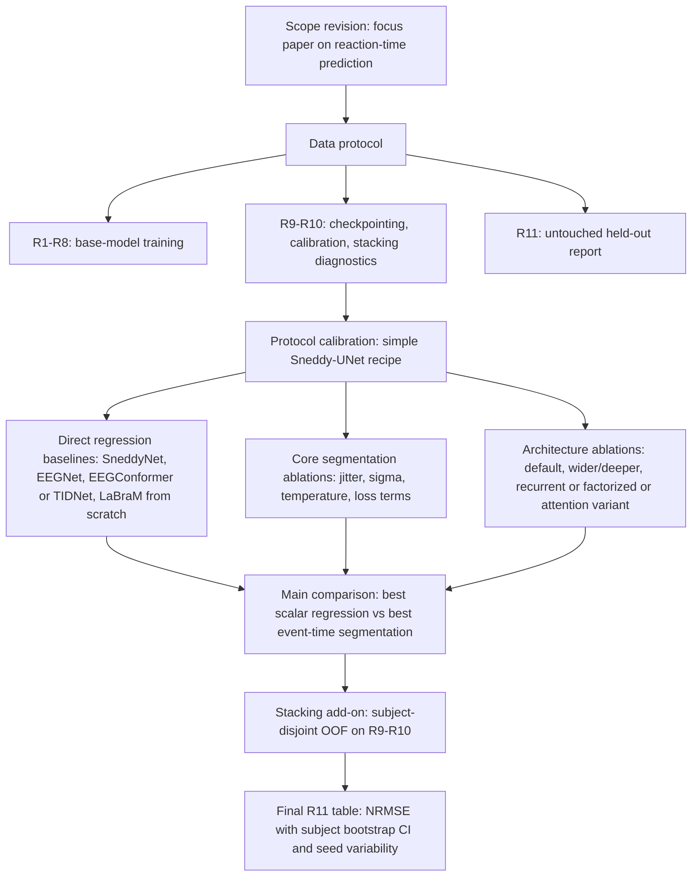

# Benchmark Runs

Manual run history for paper-facing benchmark experiments. Each entry records
the controlled change and the result interpretation.

## Running Commands

```bash
python benchmarks/run.py benchmarks/configs/0_demo/unet_deeper_demo.yaml
python benchmarks/run.py benchmarks/configs/0_demo/unet_deeper_two_stage_demo.yaml
```

For a specific experiment:

```bash
python benchmarks/run.py benchmarks/configs/<group>/<config>.yaml
```

Artefacts are written under:

```text
benchmarks/experiments/<experiment>/<run_name>/
```

Current exploratory configs are collected under
`benchmarks/configs/00_protocol_calibration/`. Clean paper-facing configs for
baseline, ablation and stacking reruns will be recreated in their own groups
after the protocol is frozen.

## Protocol Notes

Segmentation calibration tests controlled changes to the simple Sneddy-UNet
training protocol: optimizer, learning rate and soft-label width.

Regression baselines should be reported under a simple protocol first: fixed
2 s windows, no mixup, batch size 128, patience 20, same train/validation split,
same early stopping and NRMSE monitor. The current paper-facing augmentation
candidate is the mild v2 recipe from `sneddy_net_other_aug_bs128_v2`: channel
dropout probability 0.25 with max ratio 0.3, 25% temporal cutout up to 0.5 s,
and moderate Gaussian noise. The older strong augmentation remains an ablation
because channel dropout up to 50% and 1 s cutout on a 2 s window are hard to
defend as the default baseline protocol.

The development split R9-R10 was used for model checkpointing, calibration, and
for fitting a prespecified stacking procedure. To avoid within-subject leakage
in the stacking analysis, meta-model performance on R9-R10 was estimated using
subject-disjoint out-of-fold predictions. We treat R9-R10 results as development
diagnostics rather than final generalization estimates. All main performance
claims are based on R11, which was not used for base-model training,
checkpointing, calibration, stacking design, or hyperparameter selection.

## 00 Protocol Calibration

### Designs

| name | date | notes |
| --- | --- | --- |
| unet_deeper_default | 2026-06-29 12:29 UTC | Simple segmentation baseline: Adam lr=1e-3, no plateau reload, sigma=0.15. Stored before the NRMSE scale fix, so raw score is divided by 1000 for comparison. |
| unet_deeper_lr2e4 | 2026-06-29 13:22 UTC | Same as default, only Adam lr reduced to 2e-4. Stored before the NRMSE scale fix. |
| unet_deeper_sgd | 2026-06-29 14:18 UTC | Same as default, only optimizer changed to SGD lr=1e-3. Stored before the NRMSE scale fix and affected by old best-metric scale mismatch. |
| unet_deeper_adamw | 2026-06-29 14:50 UTC | Same as default, optimizer changed to AdamW lr=1e-3 with weight_decay=0. Rerun after the NRMSE scale fix. |
| unet_deeper_sigma012 | 2026-06-29 15:48 UTC | Same as default, only soft-label sigma reduced from 0.15 to 0.12. |
| unet_deeper_sigma018 | 2026-06-29 20:13 UTC | Same as default, only soft-label sigma increased from 0.15 to 0.18. |
| unet_deeper_default_bs128 | 2026-06-30 13:01 UTC | Same as default, only train batch size reduced from 2000 to 128. Tests whether more optimizer steps improve the segmentation protocol. |
| unet_deeper_default_bs512 | 2026-06-30 13:19 UTC | Same as default, only train batch size reduced from 2000 to 512. Follow-up to separate the batch-size effect from the very small-bs setting. |
| unet_deeper_default_bs128_aug_v2 | 2026-06-30 14:50 UTC | Same as `unet_deeper_default_bs128`, but with explicit mild v2 augmentation: dropout range 0.3, 0.5 s max cutout, noise probability 0.3 and lower random noise. |

### Results

| name | epoch | valid_nrmse | result note |
| --- | ---: | ---: | --- |
| unet_deeper_default | 21 | 0.930441 | Original large-batch simple-protocol baseline; validation worsened after epoch 21 while train kept improving. |
| unet_deeper_lr2e4 | 12 | 0.949753 | Worse than default; lr=2e-4 looks too conservative. |
| unet_deeper_sgd | 10 | 1.048704 | Clearly worse early trajectory than Adam. |
| unet_deeper_adamw | 21 | 0.930456 | Essentially tied with Adam. With weight_decay=0, this is not a meaningful decoupled-weight-decay ablation. |
| unet_deeper_sigma012 | 15 | 0.931072 | Slightly worse than sigma=0.15; sharper labels do not help this simple protocol. |
| unet_deeper_sigma018 | 21 | 0.934803 | Worse than sigma=0.15; smoother labels also do not help. |
| unet_deeper_default_bs128 | 14 | 0.927352 | Batch-size pivot improved the original large-batch baseline; later improved by the mild v2 augmentation variant. |
| unet_deeper_default_bs512 | 10 | 0.935622 | Worse than both bs128 and the original large-batch baseline; intermediate batch size does not explain the bs128 gain. |
| unet_deeper_default_bs128_aug_v2 | 17 | 0.923423 | Current best segmentation calibration result and preferred pivot for subsequent segmentation ablations. |

## 01 Regression Baselines

### Designs

| name | date | notes |
| --- | --- | --- |
| sneddy_net_default | 2026-06-29 20:43 UTC | First direct SneddyNet regression baseline on fixed 2 s windows. Uses the earlier notebook-like regression protocol with mixup. |
| sneddy_net_stable | 2026-06-29 20:53 UTC | Same architecture with mixup disabled. This is a cleaner direct-regression point than `sneddy_net_default`. |
| sneddy_net_stable_bs512 | 2026-06-30 12:25 UTC | Same as `sneddy_net_stable`, but train batch size reduced from 2000 to 512. |
| sneddy_net_stable_bs128 | 2026-06-30 12:45 UTC | Same strong augmentation as `sneddy_net_stable`, but train batch size reduced to 128. |
| sneddy_net_stable_bs128_noaug | 2026-06-30 13:58 UTC | Same as `sneddy_net_stable_bs128`, but train augmentation disabled. |
| sneddy_net_other_aug_bs128 | 2026-06-30 14:16 UTC | SneddyNet bs128 with the first mild augmentation recipe: lower channel dropout, shorter cutout, and lower noise than the old strong augmentation. |
| sneddy_net_other_aug_bs128_v2 | 2026-06-30 14:32 UTC | SneddyNet bs128 with the current mild v2 augmentation candidate: channel dropout proba 0.25, max ratio 0.3, 0.5 s max cutout, and moderate noise. |
| sneddy_net_other_aug_bs128_v2_wd1e6 | 2026-07-01 | Same as `sneddy_net_other_aug_bs128_v2`, but Adam weight_decay increased from 0 to 1e-6. |
| eegnet_default | 2026-06-30 07:37 UTC | Direct Braindecode EEGNet without per-sample standardization wrapper, Adam lr=1e-3. Kept as an exploratory pre-rename run with an archived config. |
| eegnet_default_bs128 | 2026-06-30 13:34 UTC | Direct EEGNet with restored default lr=1e-3 recipe, train batch size 128, and patience 20. |
| eegnet_wrapped | 2026-06-30 08:45 UTC | EEGNet wrapped with per-sample standardization, Adam lr=1e-3, strong augmentation. The global summary has this run, but the local artefact directory is not currently present. |
| eegnet_wrapped | 2026-06-30 09:01 UTC | Same named protocol, Adam lr=1e-3. Did not beat NRMSE=1 baseline. |
| eegnet_wrapped_lr1e2 | 2026-06-30 09:09 UTC | Same as wrapped EEGNet, but Adam lr=1e-2. Postfactum renamed because this LR change materially affected the result. |
| eegnet_wrapped_bs128 | 2026-06-30 13:43 UTC | Wrapped EEGNet with restored default lr=1e-3 recipe, train batch size 128, and patience 20. |
| eegnet_lr1e2 | 2026-06-30 09:27 UTC | Pure EEGNet without wrapper, Adam lr=1e-2, strong augmentation. Tests whether the LR gain depends on per-sample standardization. |
| eegnet_lr1e2_noaug | 2026-06-30 09:35 UTC | Pure EEGNet without wrapper, Adam lr=1e-2, no augmentation. This is the preferred paper-facing simple EEGNet baseline. |
| labram_default | 2026-06-30 11:25 UTC | Braindecode LaBraM trained from scratch on fixed 2 s windows, AdamW lr=3e-4, weight_decay=1e-2, no augmentation. Large-model baseline; not a pretrained-model claim. |

### Results

| name | epoch | valid_nrmse | result note |
| --- | ---: | ---: | --- |
| sneddy_net_default | 11 | 0.997383 | Barely improves over target-std baseline; mixup likely destabilizes direct scalar regression. |
| sneddy_net_stable | 78 | 0.948825 | Disabling mixup substantially improves direct regression, but it still trails the segmentation baseline. |
| sneddy_net_stable_bs512 | 58 | 0.938593 | Smaller batch size helped relative to bs2000, but it was later improved by bs128 runs. |
| sneddy_net_stable_bs128 | 25 | 0.936467 | Strong augmentation plus bs128 improved SneddyNet further, but the augmentation is aggressive for a paper-facing default. |
| sneddy_net_stable_bs128_noaug | 13 | 0.944461 | No-augmentation bs128 is worse than augmented bs128, showing that some regularization helps direct regression. |
| sneddy_net_other_aug_bs128 | 16 | 0.938723 | Mild v1 nearly recovers the strong-augmentation gain while being more defensible. |
| sneddy_net_other_aug_bs128_v2 | 22 | 0.933637 | Current best direct-regression result and preferred paper-facing augmentation candidate. |
| sneddy_net_other_aug_bs128_v2_wd1e6 | 22 | 0.936081 | Adam weight_decay=1e-6 is slightly worse than the wd=0 mild v2 pivot, so weight decay should not become the default from this run. |
| eegnet_default |  | 1.000000 | Direct EEGNet with lr=1e-3 did not beat the NRMSE=1 baseline. |
| eegnet_default_bs128 |  | 1.000000 | Reducing batch size and increasing patience did not make unwrapped EEGNet beat the baseline. |
| eegnet_wrapped |  | 1.000000 | Per-sample standardization wrapper alone did not help under lr=1e-3 and strong augmentation. |
| eegnet_wrapped |  | 1.000000 | Repeat lr=1e-3 wrapped run also did not beat baseline. |
| eegnet_wrapped_lr1e2 | 36 | 0.960001 | Higher lr makes wrapped EEGNet train meaningfully, but it remains weaker than `sneddy_net_stable`. |
| eegnet_wrapped_bs128 | 55 | 0.956806 | Wrapped EEGNet benefits from bs128/patience20, but remains clearly behind SneddyNet. |
| eegnet_lr1e2 |  | 1.000000 | Pure EEGNet with lr=1e-2 and strong augmentation still did not beat the NRMSE=1 baseline. The LR benefit seen in `eegnet_wrapped_lr1e2` appears to depend on per-sample standardization. |
| eegnet_lr1e2_noaug |  | 1.000000 | Pure EEGNet with lr=1e-2 and no augmentation also did not beat baseline. This supports keeping no-augmentation as the defensible simple protocol, while reporting that EEGNet itself remains weak here. |
| labram_default | 12 | 0.952806 | From-scratch LaBraM is competitive with the direct-regression baselines, but does not beat `sneddy_net_stable` and is still behind the segmentation protocol. |

## Experiment Design Draft



### Reviewer-Facing Table Plan

| table | purpose |
| --- | --- |
| Splits and counts | Document release roles, no subject overlap, and the fact that R11 is untouched. |
| Direct regression baselines | Show that scalar RT regression is a reasonable baseline but does not explain the segmentation gain. |
| Core segmentation ablations | Test the method components: event-time formulation, soft-label width, crop jitter, temperature tuning, and loss terms. |
| Architecture variants | Separate formulation effects from model capacity and architectural choices. |
| Stacking and calibration | Report stacking as a prespecified add-on using subject-disjoint OOF diagnostics on R9-R10, with final application to R11. |
| Final R11 results | Main paper claims: best regression, best single segmentation model, optional ensemble/stacking, all with subject-level bootstrap CIs. |

## Minimum Required Experiment Plan

This is the smallest set that should cover the mandatory revision claims. It
reuses existing configs where possible; new YAML files can be created by copying
the referenced baseline and changing only the listed fields.

### 1. Lock the Simple Segmentation Protocol

| run | start from | change | claim covered |
| --- | --- | --- | --- |
| Sneddy-UNet default | `configs/00_protocol_calibration/unet_deeper_default_bs128_aug_v2.yaml` | keep bs128 plus mild v2 augmentation as the segmentation pivot recipe | Main event-time segmentation result. |
| sigma 0.12 | `unet_deeper_default_bs128_aug_v2.yaml` | `trainer.params.sigma: 0.12` and train dataset `sigma: 0.12` | Sensitivity to soft target width. |
| sigma 0.18 | `unet_deeper_default_bs128_aug_v2.yaml` | `trainer.params.sigma: 0.18` and train dataset `sigma: 0.18` | Sensitivity to soft target width. |
| no crop jitter | `unet_deeper_default_bs128_aug_v2.yaml` | set `crop_proba: 0.0` | Tests whether label-consistent jitter contributes. |
| no temperature tuning | best segmentation config | skip post-hoc temperature calibration | Separates model quality from calibration. |
| simple loss | best segmentation config | disable auxiliary distribution losses if enabled | Shows gain is not from an overfit loss cocktail. |

### 2. Direct Regression Baselines

| run | start from | change | claim covered |
| --- | --- | --- | --- |
| SneddyNet mild v2 | `configs/00_protocol_calibration/sneddy_net_other_aug_bs128_v2.yaml` | bs128, patience20, no mixup, mild v2 augmentation | Current direct-regression pivot recipe. |
| SneddyNet noaug | `configs/00_protocol_calibration/sneddy_net_stable_bs128_noaug.yaml` | disable train augmentation only | Augmentation ablation for the regression protocol. |
| SneddyNet strong aug | `configs/00_protocol_calibration/sneddy_net_stable_bs128.yaml` | use older strong augmentation | Upper-bound/exploratory augmentation ablation; not preferred as default. |
| SneddyNet high LR | `configs/00_protocol_calibration/sneddy_net_stable_lr1e2.yaml` | keep as exploratory recipe if it becomes stable | Checks whether direct regression mainly needed LR tuning. |
| EEGNet default bs128 | `configs/00_protocol_calibration/eegnet_default_bs128.yaml` | apply the regression pivot batch/patience recipe | Canonical Braindecode baseline. |
| EEGNet wrapped bs128 | `configs/00_protocol_calibration/eegnet_wrapped_bs128.yaml` | add `WithStdPerSample` to the same recipe | Fair variant with our per-sample normalization. |
| EEGConformer | copy EEGNet noaug config | replace model with `braindecode.models.EEGConformer` and matching shape params | Modern Braindecode baseline. |
| TIDNet or Deep4Net | copy EEGNet noaug config | replace model with one additional standard architecture | Second canonical non-Sneddy baseline. |
| LaBraM from scratch | `configs/00_protocol_calibration/labram_default.yaml` | keep pretrained disabled | Large modern baseline without external-data advantage. |

### 3. Architecture Ablations

| run | start from | change | claim covered |
| --- | --- | --- | --- |
| Sneddy-UNet default | best segmentation config | keep base architecture | Reference architecture. |
| wider/deeper | best segmentation config | increase channels/depth only | Capacity effect. |
| recurrent variant | best segmentation config | swap to recurrent segmentation model | Tests temporal recurrence. |
| factorized or attention variant | best segmentation config | swap to one structured variant | Tests whether the formulation is robust across architecture choices. |

### 4. Stacking and Final Reporting

| run | start from | change | claim covered |
| --- | --- | --- | --- |
| best single model | best segmentation checkpoint | report R9-R10 diagnostics and R11 | Main single-model result. |
| average logits/probs | saved validation/test logits | average fixed candidate models | Simple ensemble baseline. |
| ridge stacker | saved OOF predictions on R9-R10 | subject-disjoint OOF meta-learning | Shows stacking gain without within-subject leakage. |
| final R11 bootstrap | saved R11 predictions | cluster bootstrap by subject | Confidence intervals for final claims. |

### Priority Order

1. Finish segmentation default plus the minimal sigma/jitter/temperature ablations.
2. Run SneddyNet, EEGNet, EEGConformer and one extra Braindecode baseline under the same simple regression protocol.
3. Add one or two segmentation architecture variants only after the core method table is stable.
4. Save logits/predictions for the best candidates and run stacking as a separate add-on analysis.
5. Compute subject-level bootstrap CIs on R11 for the final table.
