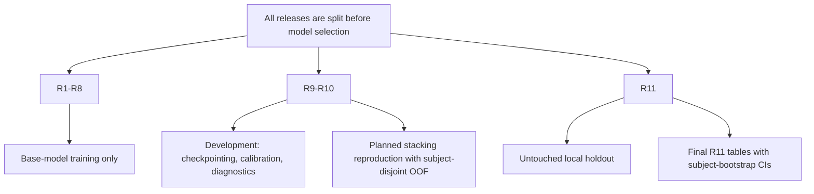
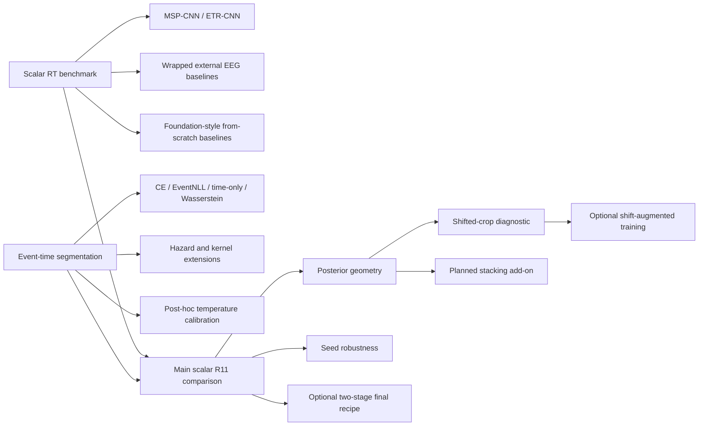

# Benchmark Runs

Manual run history for paper-facing benchmark experiments. Each entry records
the controlled change and the result interpretation.

## Running Commands

```bash
python benchmarks/scripts/run.py benchmarks/configs/0_demo/unet_deeper_demo.yaml
python benchmarks/scripts/run.py benchmarks/configs/0_demo/unet_deeper_two_stage_demo.yaml
```

For a specific experiment:

```bash
python benchmarks/scripts/run.py benchmarks/configs/<group>/<config>.yaml
```

Artefacts are written under:

```text
benchmarks/experiments/<experiment>/<run_name>/
```

Historical exploratory configs are collected under
`benchmarks/configs/00_protocol_calibration/`. Clean paper-facing configs now
live under `01_regression_baselines`, `02_segmentation_ablations`, and
`03_seed_robustness`. New paper-facing add-ons should get their own explicit
config groups rather than being mixed back into protocol calibration.

## Protocol Notes

Segmentation calibration tests controlled changes to the simple Sneddy-UNet
training protocol: optimizer, learning rate and soft-label width.

Regression baselines should be reported under a simple protocol first: fixed
2 s windows, no mixup, batch size 128, patience 20, same train/validation split,
same early stopping and NRMSE monitor. The current paper-facing augmentation
candidate is the mild v2 recipe from `sneddy_net_other_aug_bs128_v2`: channel
dropout probability 0.25 with max ratio 0.3, 25% temporal cutout up to 0.5 s,
and moderate Gaussian noise. The older strong augmentation remains an ablation
because channel dropout up to 50% and 1 s cutout on a 2 s window are hard to
defend as the default baseline protocol.

We use one mild augmentation recipe for all direct-regression comparisons so
that regularization is part of the protocol rather than a model-specific tuning
degree of freedom. For each training window, channel dropout is applied with
probability 0.25 and removes at most 30% of channels; temporal cutout is applied
with probability 0.25 and masks a contiguous 10-50 sample interval, i.e. at most
0.5 s in a 2 s, 100 Hz window; Gaussian noise is applied with probability 0.3
with standard deviation `0.01 + U(0, 0.01)`. These perturbations are intended to
represent plausible electrode loss, brief local signal corruption, and
measurement noise while preserving the window-level RT label. We deliberately
avoid mixup and the earlier stronger recipe, which allowed up to 50% channel
dropout and 1 s cutout, because those perturbations are harder to justify as a
default benchmark protocol for trial-wise RT regression.

The development split R9-R10 is used only as a development resource: base-model
checkpointing, calibration, protocol diagnostics, and fitting the prespecified
stacking procedure can all use this split, but R9-R10 performance is not treated
as a final generalization estimate. For stacking, meta-model inputs on R9-R10
are generated with subject-disjoint out-of-fold predictions so that the
meta-model never sees in-fold predictions for the same subject. The final
stacking comparison is then made on R11 only: best single model, simple
averaging, scalar-only stacking, and distribution-aware stacking are compared on
the same held-out release. The purpose of this analysis is to test whether
event-time distributions/logits carry reusable information beyond scalar RT
predictions, not to select a model based on R9-R10 validation gains. All main
performance claims are based on R11, which was not used for base-model training,
checkpointing, calibration, stacking design, or hyperparameter selection.

## Reader Notes

`00_protocol_calibration` is a draft area, not a paper-facing table. It mixes
segmentation and regression checks, old scale-fix runs, and negative/sanity
experiments. Current clean regression baselines are in
`01_regression_baselines`.

The current direct-regression story is that `sneddy_rt_net` is slightly best,
`sneddy_net` is nearly tied, and the strongest external baseline so far is
`tidnet_wrapped`. `wrapped` means that the external model receives the same
per-window standardization used by our models; this is the stronger and fairer
baseline than the unwrapped sanity checks.

Per-window standardization is part of the fixed neural input preprocessing
protocol, not a model-specific tuning trick. For each trial window and channel,
we subtract that channel's temporal mean and divide by its temporal standard
deviation within the same 2 s input window. This uses no label, subject-level,
train-set, validation-set, or holdout aggregate statistics, so it does not
introduce leakage. Main paper comparisons should use the standardized/wrapped
external baselines because our own models use the same normalization internally.
Unwrapped external runs are useful as sanity checks and appendix evidence that
off-the-shelf architectures are scale-sensitive under this benchmark, but they
should not be treated as the fairest external baseline.

Writer-facing guidance for the manuscript:
- In Methods, say explicitly: "All neural models receive the same input
  normalization: each channel in each 2 s trial window is centered and scaled by
  its own temporal mean and standard deviation."
- In main result tables, show the wrapped/standardized external models as the
  primary baselines. These are the fair architecture comparisons under the
  fixed preprocessing protocol.
- Move unwrapped external models to an appendix or sanity-check table. Their
  purpose is to show that, without the fixed benchmark normalization, some
  off-the-shelf instantiations are sensitive to amplitude scale and can collapse
  toward mean-like predictions.
- Avoid writing that "vanilla EEGNet/EEGConformer failed" without
  qualification. Prefer wording such as: "without the fixed benchmark
  normalization, off-the-shelf instantiations were scale-sensitive and often
  collapsed toward mean predictions."

Foundation-style architectures are evaluated as architectures, not as pretrained
models: pretrained weights are not used. We also avoid models that require
explicit montage/channel-position plumbing, because that would change the
benchmark setup rather than only the architecture.

Older sigma and learning-rate ablations were run before the current segmentation
pivot was fixed. Paper-grade segmentation ablations should be repeated from
`unet_deeper_default_bs128_aug_v2`.

Paper names should describe mechanisms rather than internal nicknames:
`SneddyNet` is MSP-CNN (multiscale segment pooling CNN), `SneddyRTNet` is ETR-CNN
(event-time readout CNN), and `SneddyUNet` is ETS-U-Net (event-time segmentation
U-Net).

This renaming is optional for code, but useful for the manuscript. It turns
internal model names into mechanism-level names that are easier for reviewers to
evaluate: MSP-CNN is named after its multiscale segment-statistic pooling over
fixed EEG windows, ETR-CNN after its explicit event-time/readout-oriented RT
architecture, and ETS-U-Net after the event-time segmentation formulation that
predicts temporal logits before converting them back to scalar RT. The goal is
not to rebrand the implementation, but to make the scientific comparison read
as pooling-based direct regression, event-time direct regression, and
event-time segmentation.

Conceptual framing for the manuscript: the main contribution should be
formulation-first, not "we built another EEG CNN." Many neurophysiological
analyses are already organized around events: stimulus onset, response
execution, error commission, attentional shifts, sleep transients,
epileptiform discharges, movement onset, and ERP component latencies. The
event-time segmentation formulation follows this tradition from a supervised
learning perspective. Instead of treating RT as a static scalar attached to an
entire window, it asks the model to localize when the task-relevant event occurs
and then derives the scalar prediction from the event-time distribution. This
makes time-locking, latency variability, label-consistent crop jitter, and
uncertainty estimation explicit in the learning objective.

Useful wording for the broader claim: "Although we study reaction-time
prediction, the same event-time view can apply whenever the target is tied to a
temporally localized or latency-varying neural/behavioral process, such as ERP
latency estimation, error-related potentials, sleep spindle or K-complex
detection, epileptiform spike/seizure detection, movement onset decoding, and
brain-state transitions." Keep the caveat explicit: the claim is not that every
EEG target should be segmented, but that when a behavioral or neural label has
an event-time interpretation, representing it as a distribution over time can
make the supervision better aligned with the way neuroscientists already
analyze the signal.

## Paper Experiment Outline

1. Establish the fixed-window scalar RT benchmark. The first result should make
   the task look like a serious EEG prediction benchmark rather than a custom
   model showcase. We compare compact in-house scalar regression models against
   standardized external EEG architectures under the same preprocessing,
   training, and R11 holdout protocol. The claim is intentionally conservative:
   scalar RT prediction is feasible, external architectures are meaningful
   baselines, and compact task-specific models are stronger under this protocol.

2. Introduce event-time segmentation as a formulation change. The paper should
   not sell the next step as "we used a U-Net." The main methodological move is
   to replace a scalar mapping,
   `y_hat = f(x)`, with a temporal posterior, `p(t_event | x)`, and then derive
   scalar RT from that posterior. CE, EventNLL, time-only, Wasserstein, hazard,
   and kernel variants are different ways of supervising or parameterizing the
   same event-time view. Temperature calibration is a readout/calibration layer,
   not a separate architecture claim.

3. Show that scalar accuracy is not the whole story. After the nRMSE table, the
   posterior-geometry analysis should explain why the event-time formulation is
   scientifically useful even when scalar errors are close. Two models can have
   similar RT nRMSE while encoding very different temporal evidence: CE tends to
   produce broader and better-covered distributions, EventNLL produces sharper
   target-concentrated posteriors, and scalar/time-only objectives can recover a
   mean without learning a coherent uncertainty profile. This is the main
   novelty block beyond "slightly better nRMSE."

4. Use shifted-crop inference as a shortcut diagnostic. Fixed stimulus-aligned
   windows allow a model to predict trial difficulty, subject slowness, or
   stimulus-locked response tendency without truly detecting the response-time
   event inside the crop. The shifted-crop diagnostic asks whether the prediction
   moves like an event localizer when the same 5 s trial is cropped at different
   starts. The current result is deliberately honest: neither scalar regression
   nor fixed-window segmentation becomes a perfect localizer just because the
   output is temporal. Event-time models move in a more event-like direction, but
   fixed-window training still permits stimulus-locked shortcut learning.

5. Treat shift-augmented training as the planned localization experiment. The
   natural next step is to train on randomly shifted crops with crop-relative
   labels, `RT - s`. If this works, it becomes a strong method result: once the
   shortcut is removed during training, event-time supervision should produce a
   more shift-equivariant localizer. If it does not work, the diagnostic still
   gives a defensible limitation: the available EEG signal supports scalar RT
   prediction more strongly than precise trial-wise event localization.

6. Use seed robustness as a reliability layer, not as a separate story chapter.
   The repeated runs should sit after the main results and support the claims
   that CE/EventNLL are consistently better than the scalar SneddyRTNet baseline,
   while the time-only control is closer to scalar regression. This helps argue
   that the effect comes from distributional event-time supervision rather than
   one lucky initialization.

7. Keep the final training recipe optional until it has paper-facing evidence.
   Two-stage training with checkpoint reload exists in the code path and demo
   config, but it should not be a central manuscript claim without finished
   runs. If it improves or stabilizes the final model, it can become a final
   recipe or training-stability appendix.

8. Keep stacking as an optional representation add-on. Logically, stacking
   belongs after posterior geometry: if event-time distributions carry reusable
   information beyond scalar predictions, distribution-aware stacking should
   improve over scalar-only stacking. Until those artifacts exist, it should be
   framed as a planned add-on rather than a main result.

| block | question | evidence | manuscript role | status |
| --- | --- | --- | --- | --- |
| Scalar RT benchmark | Can trial-wise RT be predicted from fixed 2 s EEG windows under a held-out R11 protocol? | SneddyNet/SneddyRTNet versus wrapped external EEG architectures. | Establishes the task, protocol, and fair scalar baselines. | Completed. |
| Event-time segmentation | Does temporal distributional supervision improve scalar RT prediction? | CE, EventNLL, time-only, Wasserstein, hazard, and kernel ablations with temperature calibration. | Main method result: RT prediction as latent event-time inference. | Completed for core losses and several extensions. |
| Posterior geometry | Do models with similar scalar error learn different temporal posteriors? | CRPS, fixed-kernel EventNLL, posterior width, near-target mass, mode-mean gap, coverage, raster and target-aligned figures. | Main novelty beyond nRMSE: output semantics differ across objectives. | Completed for calibrated R11 segmentation runs. |
| Shifted-crop diagnostic | Do fixed-window models learn event localization or scalar shortcut behavior? | 5 s R11 windows, shifted 2 s inference crops, raw shift slope, localizer-like fraction. | Diagnostic and limitation: fixed-window training permits shortcut learning. | Completed for scalar regression, CE, and EventNLL. |
| Shift-augmented training | Can crop-relative random shifts force stronger event localization? | Random crop shifts during training with labels transformed to `RT - s`. | Planned stronger localization experiment. | Planned / optional. |
| Seed robustness | Are the main gaps stable across random seeds? | Five-seed repeated runs for SneddyRTNet, TIDNet wrapped, CE, EventNLL, and time-only. | Reliability support for camera-ready claims. | Completed for current repeated set. |
| Final training recipe | Does two-stage training with checkpoint reload improve or stabilize the final model? | Two-stage/reload code path and demo config; paper-facing repeated results still needed. | Optional final recipe or appendix if results justify it. | Planned / not yet a main result. |
| Stacking add-on | Do event-time distributions provide reusable information beyond scalar predictions? | Subject-disjoint OOF stacking on R9-R10, final application to R11. | Optional performance and representation evidence. | Planned / optional. |

## Paper Artifact Registry

This registry tracks canonical paper-facing artifacts. It should point to stable
files or directories, not every intermediate plot. Use it to decide what goes
into the main paper, appendix/supplement, and reproducibility package.

| artifact | canonical path | role | publish target | status |
| --- | --- | --- | --- | --- |
| Scalar regression baselines | `benchmarks/experiments/01_regression_baselines/` | Main scalar RT benchmark and external architecture comparison. | Main table + supplement details. | Complete. |
| Event-time segmentation ablations | `benchmarks/experiments/02_segmentation_ablations/` | Main method comparison across CE, EventNLL, controls, and extensions. | Main table + appendix robustness. | Complete for current runs. |
| Calibrated posterior geometry | `benchmarks/experiments/02_segmentation_ablations/figures/posterior_geometry_calibrated/` | Output-level evidence that similar scalar errors hide different temporal posterior profiles. | Main figure/table. | Complete. |
| Base-readout posterior geometry | `benchmarks/experiments/02_segmentation_ablations/figures/posterior_geometry_base/` | Readout-sensitivity counterpart to the calibrated posterior analysis. | Supplement/appendix. | Complete. |
| Shifted-crop diagnostic report | `benchmarks/experiments/shifted_eval_camera_ready_report.md` | Diagnostic evidence for fixed-window shortcut learning and partial localization. | Main or supplement, depending on space. | Complete. |
| Shifted-crop summary table | `benchmarks/experiments/shifted_eval_camera_ready_summary.csv` | Compact numeric table behind the shifted-crop diagnostic. | Supplement/reproducibility. | Complete. |
| Seed robustness summaries | `benchmarks/experiments/03_seed_robustness/*/repeated_summary.csv` | Five-seed reliability evidence for scalar baseline, external baseline, and event-time objectives. | Main robustness table or supplement. | Complete for current repeated set. |
| Paper-facing configs | `benchmarks/configs/01_regression_baselines/`, `benchmarks/configs/02_segmentation_ablations/`, `benchmarks/configs/03_seed_robustness/` | Reproducible run definitions for main comparisons and seed robustness. | Repository/reproducibility package. | Complete for current claims. |
| Saved predictions/logits | Per-run `predictions/` directories under `benchmarks/experiments/01_*`, `02_*`, `03_*` | Recreate tables, posterior figures, calibration, shifted-crop summaries, and future stacking inputs. | Repository/supplement as storage allows. | Available for completed runs. |
| Stacking reproduction artifacts | TBD under a future paper-facing experiment group | Demonstrate whether event-time distributions/logits add information beyond scalar predictions. | Optional add-on. | Planned. |
| Shift-augmented training artifacts | TBD under a future paper-facing experiment group | Test whether crop-relative random shifts improve localization/equivariance. | Optional main extension or appendix. | Planned. |

## 01 Regression Baselines

Clean regression baselines live under
`benchmarks/configs/01_regression_baselines/`. These runs use the frozen
direct-regression protocol: fixed 2 s windows, no mixup, batch size 128,
patience 20, the same train/development/holdout releases, and R11 subject
bootstrap confidence intervals when holdout evaluation is enabled.

### Current Runs

`include`: ✓ = include in final paper-facing tables; ✗ = keep as a sanity/internal run unless space or reviewer requests require an appendix.

| include | name | role | valid_nrmse | R11 nrmse | note |
| :---: | --- | --- | ---: | ---: | --- |
| ✓ | sneddy_net | ours direct regression: MSP-CNN / SneddyNet | 0.933637 | 0.946269 [0.931609, 0.962943] | Main compact direct-regression baseline. |
| ✓ | sneddy_rt_net | ours direct regression: ETR-CNN / SneddyRTNet | 0.932577 | 0.945938 [0.930153, 0.963795] | Current best direct-regression candidate; explicit temporal readout helps slightly. |
| ✓ | sneddy_rt_net_larger | ours capacity ablation: larger ETR-CNN | 0.939308 | 0.951909 [0.936078, 0.969803] | More capacity did not improve the explicit temporal-readout model. |
| ✗ | eegnet | canonical EEG sanity check: EEGNet | 1.000000 | 1.002046 [0.999718, 1.007253] | Unwrapped EEGNet does not beat the target-std baseline. |
| ✓ | eegnet_wrapped | canonical EEG: EEGNet + per-window standardization | 0.957877 | 0.965041 [0.954684, 0.977111] | Standardization makes EEGNet train, but it remains well behind the Sneddy models. |
| ✓ | deep4net_wrapped | canonical EEG: Deep4Net + per-window standardization | 0.955678 | 0.971619 [0.956680, 0.989067] | Classical conv baseline; validation is reasonable, R11 generalization is weaker. |
| ✓ | shallowfbcspnet_wrapped | canonical EEG: ShallowFBCSPNet + per-window standardization | 0.959057 | 0.967881 [0.957767, 0.979419] | Classic shallow FBCSP-style baseline; useful reference, but weaker than TIDNet and Sneddy models. |
| ✓ | tidnet_wrapped | modern supervised: TIDNet + per-window standardization | 0.957974 | 0.959004 [0.948507, 0.970822] | Strongest external baseline on R11 so far, still behind Sneddy models. |
| ✗ | eegconformer | modern supervised sanity check: EEGConformer | 1.000000 | 1.000413 [0.999906, 1.003179] | Unwrapped transformer baseline does not train usefully under this protocol. |
| ✓ | eegconformer_wrapped | modern supervised: EEGConformer + per-window standardization | 0.957968 | 0.962802 [0.951634, 0.975382] | Modern supervised Braindecode baseline; competitive with EEGNet but not with Sneddy models. |
| ✓ | atcnet_wrapped | modern supervised: ATCNet + per-window standardization | 0.970046 | 0.977366 [0.966497, 0.990685] | Modern conv/attention/TCN baseline; works under the protocol but is not competitive here. |
| ✗ | labram | foundation-style sanity check: LaBraM from scratch | 1.000000 | 1.000711 [0.998638, 1.004512] | From-scratch unwrapped LaBraM does not train usefully. |
| ✓ | labram_wrapped | foundation-style from scratch: LaBraM + per-window standardization | 0.958254 | 0.965382 [0.952576, 0.979330] | Large architecture baseline without pretrained weights; weaker than compact Sneddy models. |
| ✗ | biot_wrapped | foundation-style from scratch: BIOT + per-window standardization | 1.000000 | 1.050931 [1.034966, 1.067444] | Foundation-style architecture baseline from scratch; did not beat the target-std baseline. |
| ✓ | eegpt_wrapped | foundation-style from scratch: EEGPT + per-window standardization | 0.967140 | 0.978796 [0.969367, 0.990273] | Recognizable EEG foundation-style architecture trained from scratch; weaker than the compact supervised baselines. |
| ✗ | medformer_wrapped | foundation-style from scratch: MEDFormer + per-window standardization | 0.983475 | 0.997271 [0.987177, 1.008893] | Larger transformer/time-series architecture baseline; nearly target-std behavior under this protocol. |

### Regression Follow-Ups

| item | status |
| --- | --- |
| SneddyRTNet seed robustness | Completed in `03_seed_robustness`. |
| TIDNet wrapped seed robustness | Completed in `03_seed_robustness` as the external optional baseline. |
| `sneddy_net_larger` MSP-CNN capacity row | Optional appendix/capacity row only; not required for the main scalar-regression claim. |

## 02 Segmentation Ablations

Clean segmentation ablations live under
`benchmarks/configs/02_segmentation_ablations/`. These runs should isolate one
methodological difference at a time relative to the segmentation pivot.

### Current Runs

`include`: ✓ = include in the core paper-facing segmentation-loss study; ✗ = keep as a sanity/internal run unless space or reviewer requests require an appendix.

Status rationale: the main table should stay focused on the event-time
formulation rather than becoming a catalogue of kernels. I keep a run as ✓ when
it either supports the central claim directly, provides a necessary negative
control, or gives a compact probabilistic extension worth discussing. Kernel
variants that do not improve R11 or clarify the story stay ✗ and can be moved to
an appendix if a reviewer asks for robustness checks.

| include | name | role | readout | temperature | valid_nrmse | R11 nrmse | note |
| :---: | --- | --- | --- | ---: | ---: | ---: | --- |
| ✓ | unet_deeper_ce_only | soft-label event-time CE only | base | 0.65 | 0.922529 | 0.938738 [0.921696, 0.958015] | Best completed matched ablation so far. Distributional event-time supervision alone is sufficient here; the explicit scalar time-loss term is not required to recover the segmentation gain. |
| ✓ | unet_deeper_ce_only | soft-label event-time CE only | calibrated tau | 0.70 | 0.922277 | 0.936942 [0.920329, 0.955704] | Same checkpoint with post-hoc temperature selected on validation logits. |
| ✓ | unet_deeper_comboloss | hybrid event-time segmentation: soft-label CE + soft-argmax time loss | base | 0.65 | 0.925601 | 0.940006 [0.921243, 0.960020] | Matched to the direct-regression protocol as closely as possible: bs128, Adam lr=1e-3, mild dropout/cutout/noise, no mixup, no crop jitter, no scale augmentation, patience 20. Competitive with CE-only, but not clearly better. |
| ✓ | unet_deeper_comboloss | hybrid event-time segmentation: soft-label CE + soft-argmax time loss | calibrated tau | 0.80 | 0.924544 | 0.935573 [0.918136, 0.954309] | Same checkpoint with post-hoc temperature selected on validation logits. |
| ✓ | unet_deeper_event_nll | continuous event-time mixture likelihood | base | 0.65 | 0.923948 | 0.942698 [0.924651, 0.962530] | Single probabilistic event-time objective: the temporal softmax defines mixture weights over latent event times and observed RT is modeled with Gaussian temporal noise. Nearly matches CE/hybrid without a hand-weighted CE+time cocktail. |
| ✓ | unet_deeper_event_nll | continuous event-time mixture likelihood | calibrated tau | 0.70 | 0.923619 | 0.940947 [0.923160, 0.960322] | Same checkpoint with post-hoc temperature selected on validation logits. |
| ✓ | unet_deeper_gaussian_mixture_event_nll | continuous event-time likelihood with narrow/wide Gaussian observation mixture | base | 0.65 | 0.922677 | 0.942161 [0.923619, 0.962018] | Paper-facing probabilistic extension: a two-scale observation kernel is a more realistic RT readout than a single Gaussian and improves validation and calibrated R11 relative to fixed Gaussian EventNLL. Include as a compact kernel-extension row, not as a new main architecture. |
| ✓ | unet_deeper_gaussian_mixture_event_nll | continuous event-time likelihood with narrow/wide Gaussian observation mixture | calibrated tau | 0.75 | 0.921676 | 0.939267 [0.921864, 0.958291] | Same checkpoint with post-hoc temperature selected on validation logits. This is the strongest EventNLL-family scalar readout so far, while the main novelty remains the latent event-time formulation. |
| ✗ | unet_deeper_laplace_event_nll | continuous event-time likelihood with Laplace observation kernel | base | 0.65 | 0.927877 | 0.943389 [0.925730, 0.962596] | Completed kernel robustness probe. It does not improve over Gaussian EventNLL on validation or R11, so it weakens the main story if placed in the core table. |
| ✗ | unet_deeper_laplace_event_nll | continuous event-time likelihood with Laplace observation kernel | calibrated tau | 0.75 | 0.926636 | 0.940696 [0.923718, 0.959285] | Calibration recovers some scalar R11 score, but the kernel is still not better than the cleaner Gaussian/mixture likelihood variants. Keep for appendix/internal robustness. |
| ✗ | unet_deeper_student_t_event_nll | robust continuous event-time mixture likelihood with Student-t observation kernel | base | 0.65 | 0.926036 | 0.946590 [0.927653, 0.967181] | Robust heavy-tailed observation kernel did not improve the Gaussian EventNLL. Keep as an appendix/internal statistical probe, not a core loss ablation. |
| ✗ | unet_deeper_student_t_event_nll | robust continuous event-time mixture likelihood with Student-t observation kernel | calibrated tau | 0.80 | 0.923259 | 0.941127 [0.923382, 0.960687] | Post-hoc temperature recovers much of the validation gap, but R11 remains essentially tied with or weaker than Gaussian EventNLL and below the best CE/combo calibrated readouts. |
| ✗ | unet_deeper_event_nll_heteroscedastic | EventNLL with trial-wise learned observation scale `sigma(x)` | base | 0.65 | 0.923056 | 0.942343 [0.923630, 0.962703] | Trial-wise sigma slightly improves validation relative to fixed Gaussian EventNLL, but does not improve R11 enough to justify inclusion in the main loss table. R11 mean predicted `event_sigma` is 0.110943 s. |
| ✓ | unet_deeper_hazard_event_nll | hazard-parameterized event-time posterior with continuous Gaussian EventNLL | base | 0.65 | 0.924318 | 0.937332 [0.920594, 0.955704] | Paper-facing alternative parameterization: a survival/hazard PMF reaches CE-level R11 without reverting to scalar regression. This strengthens the claim that the event-time formulation is not tied to one softmax implementation. |
| ✓ | unet_deeper_hazard_event_nll | hazard-parameterized event-time posterior with continuous Gaussian EventNLL | calibrated tau | 0.65 | 0.924318 | 0.937332 [0.920594, 0.955704] | Temperature selection leaves the base readout unchanged, suggesting the hazard EventNLL logits are already near their validation-optimal scale. Include as a secondary method row or compact supplement, not as a replacement for the matched softmax loss ablation. |
| ✗ | unet_deeper_hazard_discrete_nll | hazard-parameterized event-time posterior with exact-bin survival NLL | base | 0.65 | 0.926288 | 0.946823 [0.928204, 0.967220] | Useful negative control for the hazard family: exact-bin discrete survival NLL is weaker than continuous EventNLL, supporting the noisy-observation RT model. Too niche for the core table. |
| ✗ | unet_deeper_hazard_discrete_nll | hazard-parameterized event-time posterior with exact-bin survival NLL | calibrated tau | 0.65 | 0.926288 | 0.946823 [0.928204, 0.967220] | Calibration does not change the readout. Keep as internal/appendix evidence that the continuous observation model matters. |
| ✓ | unet_deeper_time_only | soft-argmax time loss only | base | 0.65 | 0.938750 | 0.951797 [0.937201, 0.967933] | Directly optimizes the scalar soft-argmax error but removes distributional supervision. Weaker than the distributional losses, supporting the claim that event-time distribution learning matters beyond scalar readout alone. |
| ✓ | unet_deeper_time_only | soft-argmax time loss only | calibrated tau | 0.85 | 0.935298 | 0.944578 [0.930935, 0.959775] | Same checkpoint with post-hoc temperature selected on validation logits. |
| ✓ | unet_deeper_wass_only | event-time Wasserstein/CDF distance only | base | 0.65 | 0.943597 | 0.960514 [0.944301, 0.978722] | Pure CDF-distance matching is the weakest completed segmentation loss ablation so far. It is useful as a negative control: not every distributional distance recovers the segmentation gain. |
| ✓ | unet_deeper_wass_only | event-time Wasserstein/CDF distance only | calibrated tau | 2.95 | 0.936941 | 0.949716 [0.934666, 0.966443] | Same checkpoint with post-hoc temperature selected on validation logits using the expanded 0.2-3.5 grid. The wider calibration range improves the readout but Wasserstein remains weaker than the CE/EventNLL losses. |

### Quantitative Posterior Geometry on R11

Generated by `benchmarks/scripts/plot_segmentation_posteriors.py` from saved
R11 logits. The paper-facing calibrated table is stored at
`benchmarks/experiments/02_segmentation_ablations/figures/posterior_geometry_calibrated/quantitative_posterior_geometry_table.csv`;
the matching caption draft is
`benchmarks/experiments/02_segmentation_ablations/figures/posterior_geometry_calibrated/captions/quantitative_posterior_geometry_table.md`.
The base-readout counterpart is stored under `posterior_geometry_base/`.

All posterior-geometry rows use the representable R11 target subset
(`15,164/15,751` trials inside the event-time support). CRPS is reported in
milliseconds. Fixed-kernel EventNLL uses the same Gaussian observation kernel
for every model (`sigma=0.15 s`), so it evaluates the posterior as an event-time
mixture likelihood rather than as the training loss of any one run.

| model | nRMSE | MAE ms | CRPS ms | fixed-kernel EventNLL | width80 ms | mass +/-150 ms | mode-mean gap ms | coverage80 | coverage MAE |
| --- | ---: | ---: | ---: | ---: | ---: | ---: | ---: | ---: | ---: |
| CE | 0.937 | 216 | 155 | 0.115 | 820 | 0.328 | 57 | 0.895 | 0.113 |
| CE+time | 0.936 | 219 | 157 | 0.144 | 860 | 0.311 | 57 | 0.899 | 0.116 |
| EventNLL | 0.941 | 216 | 162 | -0.027 | 450 | 0.487 | 72 | 0.480 | 0.290 |
| Time-only | 0.945 | 228 | 167 | 0.203 | 1070 | 0.311 | 129 | 0.913 | 0.113 |
| Wasserstein | 0.950 | 222 | 165 | 0.219 | 740 | 0.296 | 50 | 0.812 | 0.053 |

Camera-ready summary: EventNLL produces the sharpest and most
target-concentrated event-time posteriors, but these posteriors are
under-calibrated as uncertainty estimates. Thus, EventNLL is better interpreted
as a localization objective, whereas coverage-based metrics quantify whether
posterior concentration corresponds to calibrated uncertainty.

### Shifted-Crop Diagnostic on R11

Added a diagnostic evaluation to test whether RT models learn an
event-localizing representation or a stimulus-locked scalar shortcut. The
evaluation uses 5 s R11 windows and extracts 2 s test crops with starts
`s in {0.2, 0.3, 0.4, 0.5, 0.6, 0.7, 0.8}`. The reference crop is `s=0.5`,
matching the fixed-window training protocol. Metrics are reported on the
`common_inside` subset, where RT remains inside all shifted crops
(`0.8 <= RT <= 2.2`, 14,183 trials).

A true within-crop event localizer should have raw shift slope near `-1`;
a crop-invariant scalar regressor should have slope near `0`. Current
fixed-window models show only partial localization: CE and EventNLL segmentation
improve reference-crop nRMSE relative to the best scalar regressor and move the
slope in a more event-like direction, but remain far from perfect shift
equivariance (`-0.287` for CE, `-0.292` for EventNLL, `-0.253` for the best
regression baseline, and `-0.172` averaged over regression baselines). This is
best presented as evidence that fixed-window training permits scalar shortcut
learning, and as motivation for shift-augmented event-time training.

Full report and artifact index:
`benchmarks/experiments/shifted_eval_camera_ready_report.md`.

### Segmentation Follow-Ups

| item | status |
| --- | --- |
| CE, EventNLL, and time-only seed robustness | Completed in `03_seed_robustness`. |
| Extra seed robustness for combo/Wasserstein/hazard/mixture variants | Optional appendix work only if reviewer pressure requires it. |
| Shift-augmented event-time training | Planned optional experiment if we want a stronger localization claim than the current shifted-crop diagnostic supports. |

## 03 Seed Robustness

Final five-seed robustness configs live under
`benchmarks/configs/03_seed_robustness/`. They reuse the finished single-seed
recipes and change only the experiment namespace plus
`evaluation.repeated_runs.enabled: true`. The fixed seed set is
`2025, 2026, 2027, 2028, 2029`.
Each repeated config writes one top-level container
`benchmarks/experiments/03_seed_robustness/<config>_repeated__<timestamp>/`
with the five seed-run directories and `repeated_summary.csv/json` inside it.

### Completed Runs

Status checked on 2026-07-06. Values are mean +/- sample standard deviation
over completed seeds. R11 nRMSE ranges are min-max across seeds. Posterior CRPS
and fixed-kernel EventNLL are reported only for event-time segmentation runs.

| model | status | valid nRMSE | R11 nRMSE | R11 range | posterior CRPS | fixed-kernel EventNLL | artifact |
| --- | --- | ---: | ---: | ---: | ---: | ---: | --- |
| SneddyRTNet | 5/5 finished | 0.9359 +/- 0.0031 | 0.9495 +/- 0.0048 | 0.9451-0.9570 | - | - | `sneddy_rt_net_repeated__20260705_144301/repeated_summary.csv` |
| TIDNet wrapped | 5/5 finished | 0.9546 +/- 0.0014 | 0.9614 +/- 0.0046 | 0.9547-0.9656 | - | - | `tidnet_wrapped_repeated__20260705_201812/repeated_summary.csv` |
| ETS-U-Net CE | 5/5 finished | 0.9209 +/- 0.0024 | 0.9384 +/- 0.0021 | 0.9352-0.9407 | 0.1927 +/- 0.0007 | 0.3062 +/- 0.0086 | `unet_deeper_ce_only_repeated__20260705_161334/repeated_summary.csv` |
| ETS-U-Net EventNLL | 5/5 finished | 0.9242 +/- 0.0024 | 0.9391 +/- 0.0045 | 0.9318-0.9439 | 0.2011 +/- 0.0019 | 0.1523 +/- 0.0133 | `unet_deeper_event_nll_repeated__20260705_173122/repeated_summary.csv` |
| ETS-U-Net time-only | 5/5 finished | 0.9371 +/- 0.0020 | 0.9473 +/- 0.0021 | 0.9447-0.9496 | 0.2040 +/- 0.0020 | 0.3878 +/- 0.0268 | `unet_deeper_time_only_repeated__20260705_185012/repeated_summary.csv` |

Seed robustness supports the main event-time supervision claim: CE and EventNLL
segmentation are both about 0.010-0.011 R11 nRMSE better than the repeated
SneddyRTNet scalar baseline on average. The time-only segmentation control is
much closer to scalar regression, which supports the claim that the gain comes
from distributional event-time supervision rather than only the U-Net readout.
EventNLL remains slightly weaker than CE on scalar nRMSE/CRPS, but much better
under the fixed-kernel EventNLL score, consistent with its role as a sharper
probabilistic localization objective. The optional TIDNet wrapped seed run is
also complete and remains weaker than SneddyRTNet and the event-time
segmentation variants.

### Core

| config | role |
| --- | --- |
| `core/sneddy_rt_net.yaml` | Best direct-regression scalar baseline. |
| `core/unet_deeper_ce_only.yaml` | Simple event-time segmentation baseline. |
| `core/unet_deeper_comboloss.yaml` | Best current calibrated scalar segmentation readout. |
| `core/unet_deeper_event_nll.yaml` | Main principled latent event-time likelihood objective. |
| `core/unet_deeper_time_only.yaml` | Negative control: scalar soft-argmax supervision without distributional event-time learning. |
| `core/unet_deeper_wass_only.yaml` | Negative control: not every distributional loss recovers the segmentation gain. |

### Extensions

| config | role |
| --- | --- |
| `extensions/unet_deeper_hazard_event_nll.yaml` | Alternative hazard/survival parameterization of the event-time posterior. |
| `extensions/unet_deeper_gaussian_mixture_event_nll.yaml` | Two-scale observation-kernel extension of EventNLL. |

### External Optional

| config | role |
| --- | --- |
| `external_optional/tidnet_wrapped.yaml` | Completed optional external-backbone seed robustness for the strongest wrapped baseline. |

Do not run every regression model for five seeds by default. The seed robustness
budget should support the main claims: best scalar baseline, strongest
event-time segmentation readouts, principled EventNLL, and key negative
controls.

## Current Experiment Design Map

This is the active roadmap for turning the benchmark runs into a manuscript. It
supersedes the older minimum-experiment checklist and the earlier pre-freeze
design draft.

### Data Protocol



### Evidence Flow



### Reviewer-Facing Table Plan

| table | purpose |
| --- | --- |
| Splits and counts | Document release roles, no subject overlap, R9-R10 as development only, and R11 as the final holdout. |
| Scalar regression baselines | Show that fixed-window scalar RT prediction is feasible and that compact task-specific models beat standardized external EEG architectures. |
| Event-time segmentation ablations | Test the formulation with CE, EventNLL, time-only, Wasserstein, hazard, and selected kernel variants. |
| Posterior geometry scores | Quantify the output-level claim with CRPS, fixed-kernel EventNLL, posterior width, near-target mass, mode-mean gap, and coverage error on R11. |
| Shifted-crop diagnostic | Test whether fixed-window models learn event localization or stimulus-locked scalar shortcuts. |
| Seed robustness | Show that the main scalar-regression and event-time segmentation gaps survive random seed variation. |
| Optional stacking reproduction | If reproduced, test whether event-time distributions/logits add reusable information beyond scalar predictions. |
| Optional final recipe / appendix | Report shift-augmented training, two-stage checkpoint reload, additional architecture variants, or extra seed robustness only if they strengthen the manuscript. |

## Remaining Paper-Facing Work

This replaces the older minimum-experiment checklist. The clean regression
baselines, segmentation loss ablations, posterior-geometry analysis,
shifted-crop diagnostic, and seed-robustness config set are now tracked in the
sections above.

### Required

| item | purpose | current status |
| --- | --- | --- |
| Integrate seed robustness results | Estimate whether the main gaps survive random initialization and report them in the final tables. | Completed for SneddyRTNet, TIDNet wrapped, CE, EventNLL, and time-only; use the `03 Seed Robustness` summaries above. |
| Finalize main R11 tables | Keep the paper-facing comparison focused on best scalar regression, best event-time segmentation, and key negative controls. | Use `01 Regression Baselines`, `02 Segmentation Ablations`, and repeated-seed summaries. |
| Finalize posterior-geometry figure/caption | Support the claim that scalar RT error hides different event-time posterior semantics. | Current artifacts live under `02_segmentation_ablations/figures/posterior_geometry_calibrated/`. |
| Finalize shifted-crop diagnostic text | Present fixed-window shortcut learning as a diagnostic result, not as solved localization. | Full report: `benchmarks/experiments/shifted_eval_camera_ready_report.md`. |
| Clean manuscript naming | Use mechanism-level names consistently: MSP-CNN, ETR-CNN, ETS-U-Net. | Keep code names internal where needed. |

### Optional / Appendix

| item | purpose | note |
| --- | --- | --- |
| Shift-augmented event-time training | Test whether random crop shifts can turn partial localization into stronger shift equivariance. | Only needed if we want a stronger localization claim than the current diagnostic supports. |
| Kernel robustness appendix | Show that Gaussian, mixture, Laplace, Student-t, heteroscedastic, and hazard variants were tested. | Keep main table compact; avoid making the paper look like a kernel catalogue. |
| Additional external-backbone seed robustness | Check variance for external baselines beyond TIDNet. | TIDNet wrapped is already complete; run more only if reviewer-facing robustness requires it. |
| Stacking / ensembling | Test whether saved event-time distributions add information beyond scalar predictions. | Useful only if the manuscript needs an additional performance add-on. |
| Architecture variants | Separate formulation effects from architecture capacity. | Lower priority than the formulation, posterior geometry, and shifted-crop diagnostics. |

## 00 Protocol Calibration

### Designs

| name | date | notes |
| --- | --- | --- |
| unet_deeper_default | 2026-06-29 12:29 UTC | Simple segmentation baseline: Adam lr=1e-3, no plateau reload, sigma=0.15. Stored before the NRMSE scale fix, so raw score is divided by 1000 for comparison. |
| unet_deeper_lr2e4 | 2026-06-29 13:22 UTC | Same as default, only Adam lr reduced to 2e-4. Stored before the NRMSE scale fix. |
| unet_deeper_sgd | 2026-06-29 14:18 UTC | Same as default, only optimizer changed to SGD lr=1e-3. Stored before the NRMSE scale fix and affected by old best-metric scale mismatch. |
| unet_deeper_adamw | 2026-06-29 14:50 UTC | Same as default, optimizer changed to AdamW lr=1e-3 with weight_decay=0. Rerun after the NRMSE scale fix. |
| unet_deeper_sigma012 | 2026-06-29 15:48 UTC | Same as default, only soft-label sigma reduced from 0.15 to 0.12. |
| unet_deeper_sigma018 | 2026-06-29 20:13 UTC | Same as default, only soft-label sigma increased from 0.15 to 0.18. |
| unet_deeper_default_bs128 | 2026-06-30 13:01 UTC | Same as default, only train batch size reduced from 2000 to 128. Tests whether more optimizer steps improve the segmentation protocol. |
| unet_deeper_default_bs512 | 2026-06-30 13:19 UTC | Same as default, only train batch size reduced from 2000 to 512. Follow-up to separate the batch-size effect from the very small-bs setting. |
| unet_deeper_default_bs128_aug_v2 | 2026-06-30 14:50 UTC | Same as `unet_deeper_default_bs128`, but with explicit mild v2 augmentation: dropout range 0.3, 0.5 s max cutout, noise probability 0.3 and lower random noise. |

### Results

| name | epoch | valid_nrmse | result note |
| --- | ---: | ---: | --- |
| unet_deeper_default | 21 | 0.930441 | Original large-batch simple-protocol baseline; validation worsened after epoch 21 while train kept improving. |
| unet_deeper_lr2e4 | 12 | 0.949753 | Worse than default; lr=2e-4 looks too conservative. |
| unet_deeper_sgd | 10 | 1.048704 | Clearly worse early trajectory than Adam. |
| unet_deeper_adamw | 21 | 0.930456 | Essentially tied with Adam. With weight_decay=0, this is not a meaningful decoupled-weight-decay ablation. |
| unet_deeper_sigma012 | 15 | 0.931072 | Slightly worse than sigma=0.15; sharper labels do not help this simple protocol. |
| unet_deeper_sigma018 | 21 | 0.934803 | Worse than sigma=0.15; smoother labels also do not help. |
| unet_deeper_default_bs128 | 14 | 0.927352 | Batch-size pivot improved the original large-batch baseline; later improved by the mild v2 augmentation variant. |
| unet_deeper_default_bs512 | 10 | 0.935622 | Worse than both bs128 and the original large-batch baseline; intermediate batch size does not explain the bs128 gain. |
| unet_deeper_default_bs128_aug_v2 | 17 | 0.923423 | Current best segmentation calibration result and preferred pivot for subsequent segmentation ablations. |
