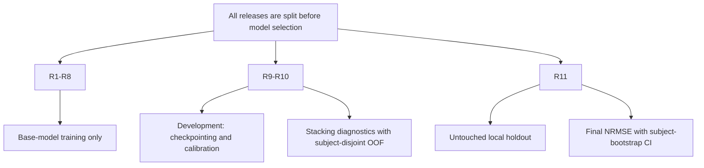
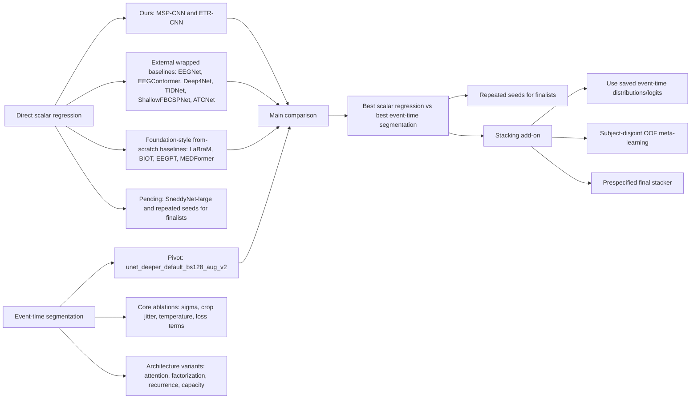

# Benchmark Runs

Manual run history for paper-facing benchmark experiments. Each entry records
the controlled change and the result interpretation.

## Running Commands

```bash
python benchmarks/scripts/run.py benchmarks/configs/0_demo/unet_deeper_demo.yaml
python benchmarks/scripts/run.py benchmarks/configs/0_demo/unet_deeper_two_stage_demo.yaml
```

For a specific experiment:

```bash
python benchmarks/scripts/run.py benchmarks/configs/<group>/<config>.yaml
```

Artefacts are written under:

```text
benchmarks/experiments/<experiment>/<run_name>/
```

Current exploratory configs are collected under
`benchmarks/configs/00_protocol_calibration/`. Clean paper-facing configs for
baseline, ablation and stacking reruns will be recreated in their own groups
after the protocol is frozen.

## Protocol Notes

Segmentation calibration tests controlled changes to the simple Sneddy-UNet
training protocol: optimizer, learning rate and soft-label width.

Regression baselines should be reported under a simple protocol first: fixed
2 s windows, no mixup, batch size 128, patience 20, same train/validation split,
same early stopping and NRMSE monitor. The current paper-facing augmentation
candidate is the mild v2 recipe from `sneddy_net_other_aug_bs128_v2`: channel
dropout probability 0.25 with max ratio 0.3, 25% temporal cutout up to 0.5 s,
and moderate Gaussian noise. The older strong augmentation remains an ablation
because channel dropout up to 50% and 1 s cutout on a 2 s window are hard to
defend as the default baseline protocol.

We use one mild augmentation recipe for all direct-regression comparisons so
that regularization is part of the protocol rather than a model-specific tuning
degree of freedom. For each training window, channel dropout is applied with
probability 0.25 and removes at most 30% of channels; temporal cutout is applied
with probability 0.25 and masks a contiguous 10-50 sample interval, i.e. at most
0.5 s in a 2 s, 100 Hz window; Gaussian noise is applied with probability 0.3
with standard deviation `0.01 + U(0, 0.01)`. These perturbations are intended to
represent plausible electrode loss, brief local signal corruption, and
measurement noise while preserving the window-level RT label. We deliberately
avoid mixup and the earlier stronger recipe, which allowed up to 50% channel
dropout and 1 s cutout, because those perturbations are harder to justify as a
default benchmark protocol for trial-wise RT regression.

The development split R9-R10 is used only as a development resource: base-model
checkpointing, calibration, protocol diagnostics, and fitting the prespecified
stacking procedure can all use this split, but R9-R10 performance is not treated
as a final generalization estimate. For stacking, meta-model inputs on R9-R10
are generated with subject-disjoint out-of-fold predictions so that the
meta-model never sees in-fold predictions for the same subject. The final
stacking comparison is then made on R11 only: best single model, simple
averaging, scalar-only stacking, and distribution-aware stacking are compared on
the same held-out release. The purpose of this analysis is to test whether
event-time distributions/logits carry reusable information beyond scalar RT
predictions, not to select a model based on R9-R10 validation gains. All main
performance claims are based on R11, which was not used for base-model training,
checkpointing, calibration, stacking design, or hyperparameter selection.

## Reader Notes

`00_protocol_calibration` is a draft area, not a paper-facing table. It mixes
segmentation and regression checks, old scale-fix runs, and negative/sanity
experiments. Current clean regression baselines are in
`01_regression_baselines`.

The current direct-regression story is that `sneddy_rt_net` is slightly best,
`sneddy_net` is nearly tied, and the strongest external baseline so far is
`tidnet_wrapped`. `wrapped` means that the external model receives the same
per-window standardization used by our models; this is the stronger and fairer
baseline than the unwrapped sanity checks.

Per-window standardization is part of the fixed neural input preprocessing
protocol, not a model-specific tuning trick. For each trial window and channel,
we subtract that channel's temporal mean and divide by its temporal standard
deviation within the same 2 s input window. This uses no label, subject-level,
train-set, validation-set, or holdout aggregate statistics, so it does not
introduce leakage. Main paper comparisons should use the standardized/wrapped
external baselines because our own models use the same normalization internally.
Unwrapped external runs are useful as sanity checks and appendix evidence that
off-the-shelf architectures are scale-sensitive under this benchmark, but they
should not be treated as the fairest external baseline.

Writer-facing guidance for the manuscript:
- In Methods, say explicitly: "All neural models receive the same input
  normalization: each channel in each 2 s trial window is centered and scaled by
  its own temporal mean and standard deviation."
- In main result tables, show the wrapped/standardized external models as the
  primary baselines. These are the fair architecture comparisons under the
  fixed preprocessing protocol.
- Move unwrapped external models to an appendix or sanity-check table. Their
  purpose is to show that, without the fixed benchmark normalization, some
  off-the-shelf instantiations are sensitive to amplitude scale and can collapse
  toward mean-like predictions.
- Avoid writing that "vanilla EEGNet/EEGConformer failed" without
  qualification. Prefer wording such as: "without the fixed benchmark
  normalization, off-the-shelf instantiations were scale-sensitive and often
  collapsed toward mean predictions."

Foundation-style architectures are evaluated as architectures, not as pretrained
models: pretrained weights are not used. We also avoid models that require
explicit montage/channel-position plumbing, because that would change the
benchmark setup rather than only the architecture.

Older sigma and learning-rate ablations were run before the current segmentation
pivot was fixed. Paper-grade segmentation ablations should be repeated from
`unet_deeper_default_bs128_aug_v2`.

Paper names should describe mechanisms rather than internal nicknames:
`SneddyNet` is MSP-CNN (multiscale segment pooling CNN), `SneddyRTNet` is ETR-CNN
(event-time readout CNN), and `SneddyUNet` is ETS-U-Net (event-time segmentation
U-Net).

This renaming is optional for code, but useful for the manuscript. It turns
internal model names into mechanism-level names that are easier for reviewers to
evaluate: MSP-CNN is named after its multiscale segment-statistic pooling over
fixed EEG windows, ETR-CNN after its explicit event-time/readout-oriented RT
architecture, and ETS-U-Net after the event-time segmentation formulation that
predicts temporal logits before converting them back to scalar RT. The goal is
not to rebrand the implementation, but to make the scientific comparison read
as pooling-based direct regression, event-time direct regression, and
event-time segmentation.

Conceptual framing for the manuscript: the main contribution should be
formulation-first, not "we built another EEG CNN." Many neurophysiological
analyses are already organized around events: stimulus onset, response
execution, error commission, attentional shifts, sleep transients,
epileptiform discharges, movement onset, and ERP component latencies. The
event-time segmentation formulation follows this tradition from a supervised
learning perspective. Instead of treating RT as a static scalar attached to an
entire window, it asks the model to localize when the task-relevant event occurs
and then derives the scalar prediction from the event-time distribution. This
makes time-locking, latency variability, label-consistent crop jitter, and
uncertainty estimation explicit in the learning objective.

Useful wording for the broader claim: "Although we study reaction-time
prediction, the same event-time view can apply whenever the target is tied to a
temporally localized or latency-varying neural/behavioral process, such as ERP
latency estimation, error-related potentials, sleep spindle or K-complex
detection, epileptiform spike/seizure detection, movement onset decoding, and
brain-state transitions." Keep the caveat explicit: the claim is not that every
EEG target should be segmented, but that when a behavioral or neural label has
an event-time interpretation, representing it as a distribution over time can
make the supervision better aligned with the way neuroscientists already
analyze the signal.

## 01 Regression Baselines

Clean regression baselines live under
`benchmarks/configs/01_regression_baselines/`. These runs use the frozen
direct-regression protocol: fixed 2 s windows, no mixup, batch size 128,
patience 20, the same train/development/holdout releases, and R11 subject
bootstrap confidence intervals when holdout evaluation is enabled.

### Current Runs

`include`: ✓ = include in final paper-facing tables; ✗ = keep as a sanity/internal run unless space or reviewer requests require an appendix.

| include | name | role | valid_nrmse | R11 nrmse | note |
| :---: | --- | --- | ---: | ---: | --- |
| ✓ | sneddy_net | ours direct regression: MSP-CNN / SneddyNet | 0.933637 | 0.946269 [0.931609, 0.962943] | Main compact direct-regression baseline. |
| ✓ | sneddy_rt_net | ours direct regression: ETR-CNN / SneddyRTNet | 0.932577 | 0.945938 [0.930153, 0.963795] | Current best direct-regression candidate; explicit temporal readout helps slightly. |
| ✓ | sneddy_rt_net_larger | ours capacity ablation: larger ETR-CNN | 0.939308 | 0.951909 [0.936078, 0.969803] | More capacity did not improve the explicit temporal-readout model. |
| ✗ | eegnet | canonical EEG sanity check: EEGNet | 1.000000 | 1.002046 [0.999718, 1.007253] | Unwrapped EEGNet does not beat the target-std baseline. |
| ✓ | eegnet_wrapped | canonical EEG: EEGNet + per-window standardization | 0.957877 | 0.965041 [0.954684, 0.977111] | Standardization makes EEGNet train, but it remains well behind the Sneddy models. |
| ✓ | deep4net_wrapped | canonical EEG: Deep4Net + per-window standardization | 0.955678 | 0.971619 [0.956680, 0.989067] | Classical conv baseline; validation is reasonable, R11 generalization is weaker. |
| ✓ | shallowfbcspnet_wrapped | canonical EEG: ShallowFBCSPNet + per-window standardization | 0.959057 | 0.967881 [0.957767, 0.979419] | Classic shallow FBCSP-style baseline; useful reference, but weaker than TIDNet and Sneddy models. |
| ✓ | tidnet_wrapped | modern supervised: TIDNet + per-window standardization | 0.957974 | 0.959004 [0.948507, 0.970822] | Strongest external baseline on R11 so far, still behind Sneddy models. |
| ✗ | eegconformer | modern supervised sanity check: EEGConformer | 1.000000 | 1.000413 [0.999906, 1.003179] | Unwrapped transformer baseline does not train usefully under this protocol. |
| ✓ | eegconformer_wrapped | modern supervised: EEGConformer + per-window standardization | 0.957968 | 0.962802 [0.951634, 0.975382] | Modern supervised Braindecode baseline; competitive with EEGNet but not with Sneddy models. |
| ✓ | atcnet_wrapped | modern supervised: ATCNet + per-window standardization | 0.970046 | 0.977366 [0.966497, 0.990685] | Modern conv/attention/TCN baseline; works under the protocol but is not competitive here. |
| ✗ | labram | foundation-style sanity check: LaBraM from scratch | 1.000000 | 1.000711 [0.998638, 1.004512] | From-scratch unwrapped LaBraM does not train usefully. |
| ✓ | labram_wrapped | foundation-style from scratch: LaBraM + per-window standardization | 0.958254 | 0.965382 [0.952576, 0.979330] | Large architecture baseline without pretrained weights; weaker than compact Sneddy models. |
| ✗ | biot_wrapped | foundation-style from scratch: BIOT + per-window standardization | 1.000000 | 1.050931 [1.034966, 1.067444] | Foundation-style architecture baseline from scratch; did not beat the target-std baseline. |
| ✓ | eegpt_wrapped | foundation-style from scratch: EEGPT + per-window standardization | 0.967140 | 0.978796 [0.969367, 0.990273] | Recognizable EEG foundation-style architecture trained from scratch; weaker than the compact supervised baselines. |
| ✗ | medformer_wrapped | foundation-style from scratch: MEDFormer + per-window standardization | 0.983475 | 0.997271 [0.987177, 1.008893] | Larger transformer/time-series architecture baseline; nearly target-std behavior under this protocol. |

### Open Regression Runs

| name | purpose |
| --- | --- |
| sneddy_net_larger | Check the older larger MSP-CNN setting as a capacity ablation before deciding whether to include it. |
| repeated seeds for best Sneddy model | Estimate seed variability for the final direct-regression claim. |
| repeated seeds for best external baseline | Estimate whether the Sneddy-vs-external gap is robust to seed variance. |

## 02 Segmentation Ablations

Clean segmentation ablations live under
`benchmarks/configs/02_segmentation_ablations/`. These runs should isolate one
methodological difference at a time relative to the segmentation pivot.

### Current Runs

`include`: ✓ = include in final paper-facing tables; ✗ = keep as a sanity/internal run unless space or reviewer requests require an appendix.

| include | name | role | readout | temperature | valid_nrmse | R11 nrmse | note |
| :---: | --- | --- | --- | ---: | ---: | ---: | --- |
| ✓ | unet_deeper_ce_only | soft-label event-time CE only | base | 0.65 | 0.922529 | 0.938738 [0.921696, 0.958015] | Best completed matched ablation so far. Distributional event-time supervision alone is sufficient here; the explicit scalar time-loss term is not required to recover the segmentation gain. |
| ✓ | unet_deeper_ce_only | soft-label event-time CE only | calibrated tau | 0.70 | 0.922277 | 0.936942 [0.920329, 0.955704] | Same checkpoint with post-hoc temperature selected on validation logits. |
| ✓ | unet_deeper_comboloss | hybrid event-time segmentation: soft-label CE + soft-argmax time loss | base | 0.65 | 0.925601 | 0.940006 [0.921243, 0.960020] | Matched to the direct-regression protocol as closely as possible: bs128, Adam lr=1e-3, mild dropout/cutout/noise, no mixup, no crop jitter, no scale augmentation, patience 20. Competitive with CE-only, but not clearly better. |
| ✓ | unet_deeper_comboloss | hybrid event-time segmentation: soft-label CE + soft-argmax time loss | calibrated tau | 0.80 | 0.924544 | 0.935573 [0.918136, 0.954309] | Same checkpoint with post-hoc temperature selected on validation logits. |
| ✓ | unet_deeper_event_nll | continuous event-time mixture likelihood | base | 0.65 | 0.923948 | 0.942698 [0.924651, 0.962530] | Single probabilistic event-time objective: the temporal softmax defines mixture weights over latent event times and observed RT is modeled with Gaussian temporal noise. Nearly matches CE/hybrid without a hand-weighted CE+time cocktail. |
| ✓ | unet_deeper_event_nll | continuous event-time mixture likelihood | calibrated tau | 0.70 | 0.923619 | 0.940947 [0.923160, 0.960322] | Same checkpoint with post-hoc temperature selected on validation logits. |
| ✓ | unet_deeper_time_only | soft-argmax time loss only | base | 0.65 | 0.938750 | 0.951797 [0.937201, 0.967933] | Directly optimizes the scalar soft-argmax error but removes distributional supervision. Weaker than the distributional losses, supporting the claim that event-time distribution learning matters beyond scalar readout alone. |
| ✓ | unet_deeper_time_only | soft-argmax time loss only | calibrated tau | 0.85 | 0.935298 | 0.944578 [0.930935, 0.959775] | Same checkpoint with post-hoc temperature selected on validation logits. |
| ✓ | unet_deeper_wass_only | event-time Wasserstein/CDF distance only | base | 0.65 | 0.943597 | 0.960514 [0.944301, 0.978722] | Pure CDF-distance matching is the weakest completed segmentation loss ablation so far. It is useful as a negative control: not every distributional distance recovers the segmentation gain. |
| ✓ | unet_deeper_wass_only | event-time Wasserstein/CDF distance only | calibrated tau | 1.80 | 0.939296 | 0.955115 [0.939171, 0.973002] | Same checkpoint with post-hoc temperature selected on validation logits. |

### Open Segmentation Runs

| name | purpose |
| --- | --- |
| repeated seeds for selected segmentation losses | Estimate seed variability for the final event-time segmentation claim. |

## Experiment Design Draft

### Data Protocol



### Model Protocol



### Reviewer-Facing Table Plan

| table | purpose |
| --- | --- |
| Splits and counts | Document release roles, no subject overlap, and the fact that R11 is untouched. |
| Direct regression baselines | Show that scalar RT regression is a reasonable baseline but does not explain the segmentation gain. |
| Core segmentation ablations | Test the method components: event-time formulation, soft-label width, crop jitter, temperature tuning, and loss terms. |
| Architecture variants | Separate formulation effects from model capacity and architectural choices. |
| Stacking and calibration | Report stacking as a prespecified add-on using subject-disjoint OOF diagnostics on R9-R10, with final application to R11. |
| Final R11 results | Main paper claims: best regression, best single segmentation model, optional ensemble/stacking, all with subject-level bootstrap CIs. |

## Minimum Required Experiment Plan

This is the smallest set that should cover the mandatory revision claims. It
reuses existing configs where possible; new YAML files can be created by copying
the referenced baseline and changing only the listed fields.

### 1. Lock the Simple Segmentation Protocol

| run | start from | change | claim covered |
| --- | --- | --- | --- |
| Sneddy-UNet default | `configs/00_protocol_calibration/unet_deeper_default_bs128_aug_v2.yaml` | keep bs128 plus mild v2 augmentation as the segmentation pivot recipe | Main event-time segmentation result. |
| sigma 0.12 | `unet_deeper_default_bs128_aug_v2.yaml` | `trainer.params.sigma: 0.12` and train dataset `sigma: 0.12` | Sensitivity to soft target width. |
| sigma 0.18 | `unet_deeper_default_bs128_aug_v2.yaml` | `trainer.params.sigma: 0.18` and train dataset `sigma: 0.18` | Sensitivity to soft target width. |
| no crop jitter | `unet_deeper_default_bs128_aug_v2.yaml` | set `crop_proba: 0.0` | Tests whether label-consistent jitter contributes. |
| no temperature tuning | best segmentation config | skip post-hoc temperature calibration | Separates model quality from calibration. |
| simple loss | best segmentation config | disable auxiliary distribution losses if enabled | Shows gain is not from an overfit loss cocktail. |

### 2. Direct Regression Baselines

| run | start from | change | claim covered |
| --- | --- | --- | --- |
| SneddyNet mild v2 | `configs/00_protocol_calibration/sneddy_net_other_aug_bs128_v2.yaml` | bs128, patience20, no mixup, mild v2 augmentation | Current direct-regression pivot recipe. |
| SneddyNet noaug | `configs/00_protocol_calibration/sneddy_net_stable_bs128_noaug.yaml` | disable train augmentation only | Augmentation ablation for the regression protocol. |
| SneddyNet strong aug | `configs/00_protocol_calibration/sneddy_net_stable_bs128.yaml` | use older strong augmentation | Upper-bound/exploratory augmentation ablation; not preferred as default. |
| SneddyNet high LR | `configs/00_protocol_calibration/sneddy_net_stable_lr1e2.yaml` | keep as exploratory recipe if it becomes stable | Checks whether direct regression mainly needed LR tuning. |
| EEGNet default bs128 | `configs/00_protocol_calibration/eegnet_default_bs128.yaml` | apply the regression pivot batch/patience recipe | Canonical Braindecode baseline. |
| EEGNet wrapped bs128 | `configs/00_protocol_calibration/eegnet_wrapped_bs128.yaml` | add `WithStdPerSample` to the same recipe | Fair variant with our per-sample normalization. |
| EEGConformer | copy EEGNet noaug config | replace model with `braindecode.models.EEGConformer` and matching shape params | Modern Braindecode baseline. |
| TIDNet or Deep4Net | copy EEGNet noaug config | replace model with one additional standard architecture | Second canonical non-Sneddy baseline. |
| LaBraM from scratch | `configs/00_protocol_calibration/labram_default.yaml` | keep pretrained disabled | Large modern baseline without external-data advantage. |

### 3. Architecture Ablations

| run | start from | change | claim covered |
| --- | --- | --- | --- |
| Sneddy-UNet default | best segmentation config | keep base architecture | Reference architecture. |
| wider/deeper | best segmentation config | increase channels/depth only | Capacity effect. |
| recurrent variant | best segmentation config | swap to recurrent segmentation model | Tests temporal recurrence. |
| factorized or attention variant | best segmentation config | swap to one structured variant | Tests whether the formulation is robust across architecture choices. |

### 4. Stacking and Final Reporting

| run | start from | change | claim covered |
| --- | --- | --- | --- |
| best single model | best segmentation checkpoint | report R9-R10 diagnostics and R11 | Main single-model result. |
| average logits/probs | saved validation/test logits | average fixed candidate models | Simple ensemble baseline. |
| ridge stacker | saved OOF predictions on R9-R10 | subject-disjoint OOF meta-learning | Shows stacking gain without within-subject leakage. |
| final R11 bootstrap | saved R11 predictions | cluster bootstrap by subject | Confidence intervals for final claims. |

### Priority Order

1. Finish segmentation default plus the minimal sigma/jitter/temperature ablations.
2. Run SneddyNet, EEGNet, EEGConformer and one extra Braindecode baseline under the same simple regression protocol.
3. Add one or two segmentation architecture variants only after the core method table is stable.
4. Save logits/predictions for the best candidates and run stacking as a separate add-on analysis.
5. Compute subject-level bootstrap CIs on R11 for the final table.

## 00 Protocol Calibration

### Designs

| name | date | notes |
| --- | --- | --- |
| unet_deeper_default | 2026-06-29 12:29 UTC | Simple segmentation baseline: Adam lr=1e-3, no plateau reload, sigma=0.15. Stored before the NRMSE scale fix, so raw score is divided by 1000 for comparison. |
| unet_deeper_lr2e4 | 2026-06-29 13:22 UTC | Same as default, only Adam lr reduced to 2e-4. Stored before the NRMSE scale fix. |
| unet_deeper_sgd | 2026-06-29 14:18 UTC | Same as default, only optimizer changed to SGD lr=1e-3. Stored before the NRMSE scale fix and affected by old best-metric scale mismatch. |
| unet_deeper_adamw | 2026-06-29 14:50 UTC | Same as default, optimizer changed to AdamW lr=1e-3 with weight_decay=0. Rerun after the NRMSE scale fix. |
| unet_deeper_sigma012 | 2026-06-29 15:48 UTC | Same as default, only soft-label sigma reduced from 0.15 to 0.12. |
| unet_deeper_sigma018 | 2026-06-29 20:13 UTC | Same as default, only soft-label sigma increased from 0.15 to 0.18. |
| unet_deeper_default_bs128 | 2026-06-30 13:01 UTC | Same as default, only train batch size reduced from 2000 to 128. Tests whether more optimizer steps improve the segmentation protocol. |
| unet_deeper_default_bs512 | 2026-06-30 13:19 UTC | Same as default, only train batch size reduced from 2000 to 512. Follow-up to separate the batch-size effect from the very small-bs setting. |
| unet_deeper_default_bs128_aug_v2 | 2026-06-30 14:50 UTC | Same as `unet_deeper_default_bs128`, but with explicit mild v2 augmentation: dropout range 0.3, 0.5 s max cutout, noise probability 0.3 and lower random noise. |

### Results

| name | epoch | valid_nrmse | result note |
| --- | ---: | ---: | --- |
| unet_deeper_default | 21 | 0.930441 | Original large-batch simple-protocol baseline; validation worsened after epoch 21 while train kept improving. |
| unet_deeper_lr2e4 | 12 | 0.949753 | Worse than default; lr=2e-4 looks too conservative. |
| unet_deeper_sgd | 10 | 1.048704 | Clearly worse early trajectory than Adam. |
| unet_deeper_adamw | 21 | 0.930456 | Essentially tied with Adam. With weight_decay=0, this is not a meaningful decoupled-weight-decay ablation. |
| unet_deeper_sigma012 | 15 | 0.931072 | Slightly worse than sigma=0.15; sharper labels do not help this simple protocol. |
| unet_deeper_sigma018 | 21 | 0.934803 | Worse than sigma=0.15; smoother labels also do not help. |
| unet_deeper_default_bs128 | 14 | 0.927352 | Batch-size pivot improved the original large-batch baseline; later improved by the mild v2 augmentation variant. |
| unet_deeper_default_bs512 | 10 | 0.935622 | Worse than both bs128 and the original large-batch baseline; intermediate batch size does not explain the bs128 gain. |
| unet_deeper_default_bs128_aug_v2 | 17 | 0.923423 | Current best segmentation calibration result and preferred pivot for subsequent segmentation ablations. |
