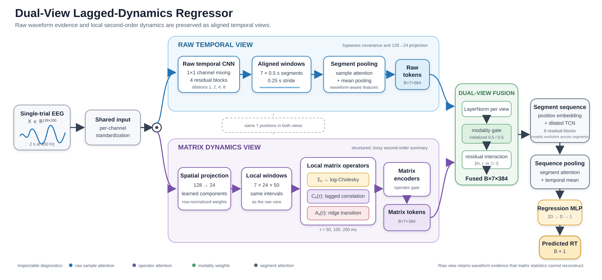

# Beyond Waveforms: Dual-View Local Population Dynamics for Single-Trial EEG Decoding

## Research project proposal for NeuroAI @ NeurIPS 2026

**Target venue:** 2nd NeuroAI Workshop @ NeurIPS 2026 — *Closed-Loop NeuroAI: Scalable Biological Priors for Adaptive Intelligence*  
**Workshop date:** December 2026, Sydney, Australia  
**Submission deadline:** August 29, 2026, 23:59 AoE  
**Format:** 5 pages excluding references and supplementary material; double-blind; non-archival  
**Project status:** architecture and initial controls implemented; full experiments pending  
**Proposal date:** July 21, 2026

## Executive summary

Most EEG decoders operate directly on voltage waveforms or replace them with summary statistics such as covariance. These representations emphasize different structure. Raw EEG preserves waveform morphology, polarity, phase, and fine temporal order, whereas local covariance explicitly represents instantaneous second-order relations but discards within-window order. Lagged cross-statistics occupy an intermediate position: they summarize how a multichannel state at time \(t\) predicts the state at \(t+\tau\), retaining selected temporal relationships without preserving the complete signal.

We propose a temporally aligned dual-view neural architecture that processes the same EEG trial through two synchronized paths. A raw temporal path learns directly from the waveform. A local-dynamics path maps overlapping EEG segments into regularized covariance matrices, lagged cross-correlation matrices, and ridge-estimated predictive transition operators. Each path produces one token per temporal segment; a learned fusion module combines corresponding raw and dynamics tokens before a shared temporal decoder predicts single-trial reaction time.

The central claim is not that the matrix path contains information absent from the raw EEG: it is a deterministic transformation of the same signal. Rather, local second-order operators may provide a useful **inductive bias** in finite-data, cross-subject learning by making population-level relational structure explicit. The dual-view model also creates a controlled way to test whether successful predictions depend on waveform morphology, instantaneous covariance, or lagged population dynamics.

The project will be evaluated on the Healthy Brain Network contrast-change detection task using a subject-disjoint, release-separated protocol. The main evidence will combine parameter-matched predictive comparisons with representational interventions, data-efficiency curves, shifted-window tests, and causal-prefix evaluation. This moves the contribution beyond a leaderboard result toward a falsifiable NeuroAI question: **when does an explicit local population-dynamics prior improve neural decoding, and what does it preserve, discard, or fail to transfer?**

## One-sentence pitch

> We introduce a temporally aligned dual-view EEG decoder that jointly represents raw waveforms and a trajectory of locally estimated population operators, enabling controlled tests of whether behavioral prediction benefits from waveform morphology, instantaneous covariance, or lagged population dynamics.

## Workshop fit

The project directly targets two themes named in the [NeuroAI 2026 call for papers](https://neuroai-workshop.github.io/call-for-papers/):

- **Priors that scale:** local covariance and lagged predictive operators are explicit relational priors derived from multichannel neural activity. Their value will be tested across training-set sizes, subjects, releases, and perturbations rather than inferred from one final score.
- **Evaluation beyond decoding:** the project evaluates representation-specific invariances, failure modes, temporal-reference behavior, branch necessity, and transfer—not only scalar RT error.

The present task is offline single-trial decoding. To connect more directly to the workshop's closed-loop theme, the planned causal-prefix experiment will ask how early and how reliably the model can update its behavioral prediction as successive EEG segments arrive. This supports a closed-loop motivation without claiming that the current experiment is itself a deployed adaptive BCI.

The neuroscience link is explicit: the model tests whether behaviorally relevant EEG structure is better expressed solely through local voltage patterns or through a combination of voltage patterns and evolving multichannel interaction statistics. The work should therefore be positioned as a NeuroAI study of representation and inductive bias, not merely as a new regression architecture.

Covariance and linear transition operators are generic multivariate time-series tools; applying them to EEG does not automatically make them biological priors. The NeuroAI contribution depends on connecting them to a falsifiable neural hypothesis—behaviorally relevant information is expressed through evolving distributed population states—and testing that hypothesis through neural-data interventions, subject transfer, and temporal analyses. If the final evidence is limited to a small RT-error improvement, the workshop fit will remain weak.

## Research premise

### Raw EEG and covariance are not equivalent representations

For one centered EEG segment \(X_s \in \mathbb{R}^{D \times L}\), the sample covariance is

\[
C_s = \frac{1}{L-1}X_sX_s^\top.
\]

Many different signals have the same \(C_s\). Covariance therefore preserves channel variances and zero-lag cross-channel relations but loses absolute within-segment sample order and cannot reconstruct the original waveform.

At the same time, \(C_s\) is fully determined by \(X_s\). Consequently, a covariance view cannot add Shannon information beyond the raw signal. Its possible benefit is representational: it exposes a statistic that a generic raw-signal network would otherwise have to approximate from data.

This distinction motivates a dual-view architecture:

- the raw branch protects information discarded by covariance and lagged summaries;
- the operator branch makes local relational structure explicit;
- aligned fusion allows the network to use either representation at each point in the trial;
- controlled interventions test whether the branches acquire the predicted sensitivities.

### Why lagged operators

Zero-lag covariance does not describe whether one multichannel state is predictive of a later state. For a lag \(\tau\), let \(X_{s,-\tau}\) and \(X_{s,+\tau}\) denote the current and future portions of segment \(s\). We estimate

\[
C_{xx,s}^{(\tau)} = \operatorname{Cov}(X_{s,-\tau},X_{s,-\tau}),
\qquad
C_{yx,s}^{(\tau)} = \operatorname{Cov}(X_{s,+\tau},X_{s,-\tau}).
\]

The normalized lagged cross-correlation describes delayed statistical dependence. The regularized predictive operator

\[
A_s^{(\tau)} = C_{yx,s}^{(\tau)}
\left(C_{xx,s}^{(\tau)} + \lambda_\tau \bar{\sigma}_s^2 I\right)^{-1}
\]

approximates the local linear mapping from the current latent channel state to the state \(\tau\) later. These operators are descriptive and predictive. They must **not** be interpreted as causal connectivity or effective connectivity because EEG sensor mixing, common inputs, and observational estimation prevent that conclusion.

## Research questions

1. Does an explicit local population-operator view improve subject-disjoint RT prediction beyond a matched raw-waveform model?
2. Do lagged operators contribute beyond zero-lag covariance?
3. Does the dual model benefit from representational complementarity rather than parameter count or generic ensembling?
4. Do the raw and operator branches exhibit the distinct invariances predicted by their mathematical representations?
5. Is the operator prior particularly useful under limited training data, cross-subject shift, temporal crop shift, channel loss, or signal noise?
6. Can the architecture update RT predictions causally as EEG segments arrive, making the representation relevant to future closed-loop decoding?

## Hypotheses

### H1 — Dual-view generalization

The parameter-matched dual-view model will improve held-out, subject-level RT prediction relative to both raw-only and matrix-only controls.

### H2 — Lagged structure beyond covariance

Adding lagged cross-correlation and predictive transition operators will improve generalization or robustness beyond a covariance-only dual model.

### H3 — Complementary sensitivities

The raw and operator branches will respond differently to controlled transformations. The operator branch should be invariant to transformations that exactly preserve its input statistics, while the raw branch may remain sensitive to changes in waveform morphology or temporal order.

### H4 — Finite-data inductive-bias benefit

The explicit operator view will provide its largest relative benefit in lower-data regimes and under subject or measurement shift, where learning equivalent second-order computations from raw EEG alone is more difficult.

### H5 — Incremental prediction

Predictions derived from successive causal prefixes will become progressively more accurate and stable as response-relevant dynamics enter the observed interval. The dual view may reach a given accuracy earlier than raw-only and matrix-only controls.

## Proposed architecture

### Input and temporal segmentation

The current HBN input is a two-second EEG crop with 128 channels and 200 samples at 100 Hz. The model uses seven overlapping 0.5-second segments with a 0.25-second stride. Both branches produce one 384-dimensional token for each of the same seven intervals.

### View 1: raw waveform encoder

The raw path receives the normalized 128-channel signal directly and therefore bypasses all covariance operations. It contains:

1. learned \(1\times1\) channel mixing;
2. four full-resolution residual temporal blocks with dilations \(1,2,4,8\);
3. aligned segment extraction only after temporal feature learning;
4. within-segment attention pooling combined with mean pooling;
5. projection to a 384-dimensional raw token per segment.

Running the temporal convolutions before pooling preserves fine waveform order and cross-segment continuity.

### View 2: local population-operator encoder

The dynamics path first applies a learned normalized spatial projection from 128 sensors to 24 latent channel mixtures. The same overlapping temporal intervals are then summarized through three operator families.

#### Regularized zero-lag covariance

For segment \(s\), covariance is stabilized through learned shrinkage:

\[
\widetilde{C}_s = (1-\alpha)C_s
+ \alpha \frac{\operatorname{tr}(C_s)}{D}I
+ \epsilon \frac{\operatorname{tr}(C_s)}{D}I.
\]

The SPD matrix is represented using a scale-aware log-Cholesky vector, avoiding unstable eigenvector gradients on short EEG windows.

#### Lagged cross-correlation

Cross-covariance is variance-normalized at lags of 50, 100, and 200 ms to represent scale-normalized delayed relations between latent channel mixtures.

#### Ridge transition operators

At the same lags, a differentiable ridge solution estimates the local predictive linear operator \(A_s^{(\tau)}\). Each lag has a learned positive ridge coefficient.

The covariance and lagged matrices are encoded separately. Attention across operator type and lag produces one dynamics token per temporal segment.

### Aligned dual-view fusion

For segment \(s\), normalized matrix and raw tokens \(m_s\) and \(r_s\) are combined by a two-way modality gate and a residual interaction term:

\[
g_s = \operatorname{softmax}\left(f_g([m_s;r_s])\right),
\]

\[
z_s = \operatorname{LN}\left(
g_{s,m}m_s + g_{s,r}r_s
+ f_u([m_s;r_s;m_s\odot r_s])
\right).
\]

The gate is initialized to equal weighting, and the residual interaction is initialized near zero. This gives the model a neutral starting point while allowing segment-specific specialization.

### Across-segment decoder

The fused token sequence is processed by six residual temporal blocks with dilations \(1,2,4\), followed by segment attention and mean pooling. A scalar head predicts RT. The shared decoder makes the raw-only, matrix-only, and dual variants directly comparable.

## Novelty claim and boundary

### What is not novel by itself

The following components have substantial precedent and should not be presented as standalone novelty:

- representing signals as SPD covariance matrices;
- deep learning on SPD representations;
- segmenting EEG and modeling a sequence of covariance matrices;
- combining spatial and temporal EEG features;
- using lagged covariance in general multivariate time-series models;
- using two branches or learned gating.

For example, prior EEG work has already divided trials into segments, computed covariance matrices, and modeled their temporal sequence with an RNN. Recent multivariate time-series work has also used extended lagged covariance as a graph prior. The paper should not claim to be the first covariance network, the first lagged covariance network, or the first dual-branch EEG model.

### Defensible novelty

The defensible contribution is the combination of a specific computational hypothesis, architecture, and evaluation protocol:

1. **Temporally aligned multi-representation decoding.** Raw waveform and local operator tokens correspond to identical temporal intervals and interact before a shared sequence model.
2. **Local operator trajectories for behavioral decoding.** The matrix view combines zero-lag covariance with multiscale lagged correlation and predictive transition operators inside an end-to-end single-trial EEG regressor.
3. **A representation-preserving bypass.** The raw branch explicitly retains information discarded by local second-order summaries.
4. **Intervention-based evaluation.** Branch masking and statistic-preserving transformations test what each representation uses, rather than treating attention weights as explanations.
5. **A finite-data NeuroAI hypothesis.** The work tests whether an explicit population-dynamics prior improves sample efficiency, robustness, and subject transfer even though the same statistics are theoretically computable from raw EEG.

The strongest paper-level claim, if supported, is:

> Local population operators provide a complementary inductive bias to raw neural waveforms, improving finite-data EEG decoding while exposing representation-specific invariances and failure modes.

## Experimental setting

### Primary dataset and task

- **Dataset:** Healthy Brain Network EEG, contrast-change detection task.
- **Target:** single-trial reaction time in the configured 0.5–2.5 s range.
- **Input:** 128 channels, 200 samples, 100 Hz.
- **Training:** releases 1–8.
- **Validation:** releases 9–10.
- **Held-out test:** release 11.
- **Protocol:** subject-disjoint and release-separated.
- **Repeated runs:** five fixed seeds.
- **Uncertainty:** paired subject-level bootstrap confidence intervals.

The release-separated test is important because it evaluates more than random trial interpolation. However, conclusions should remain limited to the population and acquisition conditions represented by HBN.

### Existing benchmark context

The new models will be compared with the already configured regression baselines, including convolutional, compact EEG-specific, attention-based, and pretrained temporal architectures. The principal baselines include ETR-CNN, MSP-CNN, EEGNet, TIDNet, ATCNet, EEGConformer, Deep4Net, ShallowFBCSPNet, Medformer, EEGPT, and LaBraM.

These architectures provide performance context. The causal comparisons for the proposed mechanism are the matched raw-only, matrix-only, and dual-view controls described below.

## Core model comparison

| Model | Raw waveform | Covariance | Lagged correlation | Transition operators | Purpose |
|---|---:|---:|---:|---:|---|
| Raw-only | Yes | No | No | No | Tests waveform path and shared decoder |
| Matrix covariance-only | No | Yes | No | No | Tests local zero-lag geometry |
| Matrix lagged-only | No | No | Yes | Yes | Tests delayed operators without covariance |
| Matrix full | No | Yes | Yes | Yes | Tests complete operator trajectory |
| Dual covariance-only | Yes | Yes | No | No | Tests raw plus zero-lag structure |
| Dual full | Yes | Yes | Yes | Yes | Proposed model |

### Capacity controls

The current implementations have approximately 2.35M parameters for raw-only, 2.85M for matrix-full, and 3.85M for dual-full. This difference is a direct alternative explanation for any predictive gain. The confirmatory comparison must therefore add:

- a widened raw-only model matched to the dual model's parameter count;
- a widened matrix-only model matched to the dual model's parameter count;
- if practical, a late-fusion or prediction-ensemble control with comparable capacity.

The existing configurations should remain unchanged for reproducibility; capacity-matched variants should be added as separate models or configurations.

## Evaluation plan

### Predictive performance

Primary reporting:

- normalized RMSE on the held-out release;
- paired per-subject difference relative to each causal control;
- 95% subject-bootstrap confidence interval;
- mean and dispersion across five fixed seeds.

Secondary reporting:

- RMSE and MAE in physical RT units;
- Pearson and Spearman association;
- subject-level performance distribution;
- prediction variance and regression-to-the-mean diagnostics.

Seeds should demonstrate optimization robustness, not be treated as independent human-subject samples. The principal uncertainty interval should resample subjects after aggregating or nesting the fixed seeds.

### Data-efficiency experiment

Train the raw-only, matrix-full, and dual-full parameter-matched models on subject-level subsets of the training releases, for example 12.5%, 25%, 50%, and 100%, while preserving the same validation and test sets. The key quantity is not only final error but the shape of the learning curve.

Prediction:

- if the operator path is a useful inductive bias, its relative advantage should be strongest when training data are limited;
- if the advantage appears only at full scale, the likely explanation is increased capacity rather than a sample-efficient prior;
- if raw-only catches up with more data, this is consistent with the raw network eventually learning equivalent statistics.

### Robustness and transfer

Evaluate all causal controls under:

- increasing channel dropout;
- additive sensor noise;
- temporal cutout;
- shifted input crops;
- subject and release shift already present in the main split.

A second behavioral endpoint, EEG task, or dataset would substantially strengthen the architecture claim. If feasible, the externalizing setting that originally motivated lagged correlation features is a natural transfer test. This should be presented as a second-domain validation only after confirming that its target, temporal granularity, and subject split support a fair comparison.

### Computational scaling

Matrix construction scales quadratically with the projected dimension, while the ridge solve has a cubic component. The learned 128-to-24 projection is therefore part of the scalability argument, not only a denoising step. Report parameter count, training throughput, inference latency, peak memory, and sensitivity to projection dimensions such as 12, 24, and 36. A useful biological prior should not require impractical full 128-by-128 operator solves for every segment and lag.

## Representational interventions

Attention and gating weights are useful diagnostics but are not sufficient evidence of mechanism. The central analyses should intervene on the signal or representations and measure changes in each branch and in the final prediction.

### 1. Branch masking

At inference, evaluate the trained dual model with:

- the raw token removed;
- the matrix token removed;
- lagged operators removed while retaining covariance;
- covariance removed while retaining lagged operators;
- individual lag slots removed.

Report the paired change in prediction and error by temporal segment. Retraining ablations test whether a component can be replaced; inference masking tests whether the trained model actually relies on it. Both are needed.

### 2. Global polarity inversion

Apply \(X \mapsto -X\). Centered covariance, lagged cross-correlation, and the fitted transition operators remain unchanged when both current and future signals change sign, while raw waveform polarity is reversed.

Expected diagnostic:

- the standalone matrix branch should be numerically invariant up to floating-point tolerance;
- any change in the dual prediction must arise through the raw path or fusion;
- failure of matrix invariance indicates an implementation or preprocessing issue.

### 3. Temporal-order intervention

Within a dedicated non-overlapping diagnostic segmentation, permute samples identically across channels. This exactly preserves zero-lag covariance for each segment while destroying waveform order and most lag-specific relationships.

Expected diagnostic:

- covariance tokens remain invariant;
- lagged tokens change strongly;
- raw tokens change strongly;
- a full dual model should degrade more than a covariance-only model if it uses temporal order.

The non-overlapping diagnostic is important because independently permuting overlapping windows cannot be represented as a single unambiguous modified trial.

### 4. Lag identity and direction

- permute lag labels after operator encoding;
- swap or reverse predictive direction where mathematically defined;
- mask 50, 100, or 200 ms operators individually;
- compare the learned ridge coefficients and operator usage across lags.

These tests determine whether the model uses specific delayed structure or merely benefits from extra matrix-valued features.

### 5. Temporal-reference shift

Use the existing shifted-crop evaluation across crop starts from 0.2 to 0.8 s, with 0.5 s as the reference. Compare:

- prediction movement under crop shift;
- raw, matrix, and dual sensitivity slopes;
- whether internal segment attention and modality balance move with the crop;
- whether the prediction follows temporal evidence or a fixed-window shortcut.

This analysis should be framed as a test of temporal-reference behavior, not as proof of full equivariance.

### 6. Channel corruption

Measure performance and branch dependence as channels are dropped or corrupted. Covariance is not automatically robust to missing channels, especially because the spatial projection is learned on a fixed montage. The experiment should therefore test robustness rather than assume it.

## Causal-prefix extension

To make the closed-loop relevance concrete, evaluate the models on progressively longer causal prefixes:

\[
X_{1:t_1}, X_{1:t_2}, \ldots, X_{1:t_K}.
\]

Two implementation options are possible:

1. use the same trained model with future samples masked and validate that masking does not introduce an artificial cue;
2. train an explicit anytime model with a prediction head after each available segment and a weighted prefix loss.

Two evaluation regimes must be distinguished:

- **retrospective prefix decoding:** estimate the eventual RT from all trials using only the first \(t\) seconds;
- **prospective closed-loop prediction:** at prefix \(t\), evaluate only trials whose response has not yet occurred, or model the conditional remaining time or response hazard.

Without this distinction, an apparently early decoder may partly identify response-evoked EEG from trials in which the response already occurred before the prefix ended. Only the prospective regime supports a closed-loop prediction claim.

Report:

- RT error as a function of available EEG duration;
- prediction stability between successive prefixes;
- earliest time at which each model reaches a predefined accuracy band;
- raw-versus-operator contribution over observation time.

This experiment supports the claim that the representation is suitable for incremental decoding. It does not by itself demonstrate closed-loop adaptation, co-adaptation, or clinical utility.

## Analysis of learned representations

### Modality and temporal use

Summarize modality gate values and segment attention as functions of:

- temporal segment;
- observed RT;
- prediction error;
- signal quality;
- subject;
- perturbation condition.

Gate values should be treated as model behavior, not as direct neural explanations. Validate any apparent specialization with branch masking.

### Operator geometry

Possible descriptive analyses include:

- covariance spectrum or log-Cholesky norm over segments;
- transition-operator norm and spectral radius;
- similarity of operator trajectories within and across subjects;
- lag-specific token magnitude and gate contribution;
- relation between operator changes and RT bins.

These statistics can reveal whether behavior is associated with a static interaction pattern or a temporal reconfiguration. They should not be mapped to anatomical connectivity without source localization and appropriate controls for volume conduction.

### Representation overlap

Use representational similarity or linear probing to estimate how much information about matrix tokens is recoverable from raw tokens and vice versa. A useful result would distinguish:

- predictive complementarity;
- redundant representations with easier optimization;
- branch specialization induced only by the gate.

This analysis is exploratory unless a specific similarity measure and null model are preregistered before test-set inspection.

## Decision criteria and falsification

### Core claim supported

The main claim is supported if:

1. dual-full improves over both parameter-matched raw-only and matrix-only models under the paired subject-level analysis;
2. the direction is stable across the fixed seeds;
3. branch masking shows that both views are used by the trained model;
4. representation-preserving interventions produce the predicted selective sensitivities.

### Lagged-dynamics claim supported

The lagged claim is supported if dual-full improves over dual covariance-only in performance, robustness, or data efficiency and if lag-specific interventions confirm that the model uses lag identity or direction.

### Results that would weaken or falsify the story

- The dual advantage disappears after parameter matching.
- The dual model collapses almost completely onto one branch.
- Matrix-full does not improve on covariance-only and is insensitive to lag interventions.
- Perturbations do not produce the predicted branch-specific behavior.
- Gains occur only for one seed or a small subset of subjects.
- Gate weights appear interpretable but branch masking contradicts them.
- The model improves only on the original crop and fails under modest temporal or sensor shift.

These outcomes remain scientifically informative, but the paper should then be reframed as a negative or diagnostic result about the limits of explicit population-operator priors.

## Expected contributions

If the hypotheses are supported, the workshop submission will make four contributions:

1. **Method:** a temporally aligned dual-view architecture for raw EEG and local population-operator trajectories.
2. **Inductive-bias result:** evidence that explicitly computed second-order dynamics can improve finite-data, subject-disjoint neural decoding beyond what matched raw models learn implicitly.
3. **Mechanistic evaluation:** a suite of statistic-preserving interventions that separates waveform, covariance, and lagged-operator dependence.
4. **Closed-loop bridge:** causal-prefix evaluation showing when each representation becomes behaviorally informative as neural data arrive.

## Claims to avoid

The submission should not claim:

- causal or effective connectivity;
- recovery of true neural sources from sensor-space operators;
- that covariance adds information not contained in the raw signal;
- that learned gates are neural explanations;
- full temporal equivariance based only on shifted crops;
- general-purpose superiority based on one EEG task;
- closed-loop adaptation without an actual adaptation experiment.

Preferred language includes **predictive operator**, **lagged statistical dependence**, **latent channel mixture**, **local population-dynamics prior**, **representation-specific invariance**, and **closed-loop-ready incremental decoding**.

## Reviewer-risk register

| Likely concern | Planned mitigation |
|---|---|
| “This is covariance feature engineering.” | Emphasize the falsifiable inductive-bias question, end-to-end learned projection and regularization, raw bypass, and intervention suite. |
| “Segmented covariance sequences already exist.” | Make no first-use claim; distinguish aligned raw/operator fusion, lagged predictive operators, behavioral regression, and controlled invariance tests. |
| “The gain is caused by more parameters.” | Add widened parameter-matched raw and matrix controls and report learning curves. |
| “Covariance destroys important EEG timing.” | State this explicitly; retain the raw path and quantify what is lost through temporal-order interventions. |
| “The operators are just volume conduction.” | Avoid connectivity claims, use latent statistical-operator language, and discuss sensor mixing as a limitation. |
| “Short-window covariance is unreliable.” | Use dimensionality reduction, shrinkage, ridge regularization, log-Cholesky mapping, and sensitivity analyses over segment length and projection dimension. |
| “The selected lags are arbitrary.” | Motivate 50/100/200 ms as multiscale probes and test individual lag removal and nearby alternatives. |
| “The matrix computation will not scale.” | Report throughput and memory, retain the low-dimensional learned projection, and test the accuracy–cost trade-off across projection dimensions. |
| “Attention is not explanation.” | Use branch masking and statistic-preserving counterfactuals as the primary evidence. |
| “This is not closed loop.” | Include causal-prefix evaluation and restrict claims to incremental readiness unless a true adaptive experiment is added. |
| “One task cannot establish a general architecture.” | Add a second endpoint or dataset if feasible; otherwise narrow the claim to HBN RT decoding. |

## Proposed five-page paper structure

### Page 1 — Motivation and hypothesis

- raw waveforms versus explicit population statistics;
- deterministic-transform versus inductive-bias distinction;
- NeuroAI question and contributions.

### Page 2 — Method

- architecture figure;
- covariance and lagged-operator definitions;
- aligned fusion and causal controls.

### Page 3 — Experimental design

- HBN release-separated protocol;
- parameter-matched models;
- subject-level statistics;
- intervention suite.

### Page 4 — Core results

- compact predictive comparison;
- data-efficiency or robustness curve;
- covariance-only versus lagged/full result.

### Page 5 — Beyond-decoding result and discussion

- perturbation or causal-prefix figure;
- what each representation preserves and loses;
- limitations, NeuroAI implication, and conclusion.

Suggested main-paper visual budget:

1. **Figure 1:** architecture and representation hierarchy.
2. **Figure 2:** parameter-matched predictive and data-efficiency results.
3. **Figure 3:** intervention signatures or causal-prefix curves.
4. **Table 1:** compact held-out metrics and ablations.

Additional seeds, subject distributions, lag sweeps, and full benchmark tables can go in the supplement.

## Working titles

1. **Beyond Waveforms: Dual-View Local Population Dynamics for Single-Trial EEG Decoding**
2. **Local Population Operators as an Inductive Bias for EEG Decoding**
3. **What Does an EEG Decoder Use? Separating Waveforms from Local Population Dynamics**
4. **Raw Signals and Lagged Population Operators as Complementary Views of EEG**
5. **From Waveforms to Local Operators: Testing a Population-Dynamics Prior for Neural Decoding**

Title 3 is strongest if the intervention results become the central contribution. Title 2 is strongest if data efficiency and transfer provide the clearest result. Title 1 is the safest general working title.

## Work plan to submission

### July 21–26: core runs

- complete raw-only, matrix-only, dual covariance-only, and dual-full five-seed runs;
- verify saved subject and trial identifiers;
- produce paired subject-level comparison tables;
- audit failed and incomplete runs before interpretation.

### July 27–August 2: causal controls

- add parameter-matched raw-only and matrix-only configurations;
- run covariance-only versus lagged-only versus full comparisons;
- confirm identical data, optimizer, augmentation, stopping, and evaluation settings;
- freeze the primary model comparison before examining additional diagnostics.

### August 3–9: interventions

- implement inference branch masking;
- verify exact matrix invariance under global polarity inversion;
- implement the non-overlapping temporal-order diagnostic;
- run lag-slot and shifted-crop analyses.

### August 10–16: NeuroAI strengthening

- run subject-level data-efficiency curves;
- evaluate channel dropout and noise robustness;
- implement causal-prefix evaluation;
- decide whether a second task is feasible without weakening the core study.

### August 17–23: paper assembly

- lock claims based on completed evidence;
- prepare the three main figures and one table;
- draft the five-page anonymous paper;
- write limitations before finalizing the abstract.

### August 24–28: validation and submission checks

- rerun all table and figure generation from saved artifacts;
- verify subject-disjoint splits and paired statistics;
- remove identifying metadata and repository links from the blinded version;
- check the NeurIPS 2026 template and five-page limit;
- prepare supplementary material and submit before August 29 AoE.

## Current implementation assets

- [Dual-view and raw-only models](../../benchmarks/pkg/models/regression/dual_view_lagged_dynamics.py)
- [Matrix-only lagged-dynamics model](../../benchmarks/pkg/models/regression/lagged_dynamics.py)
- [Dual-view experiment configurations](../../benchmarks/configs/08_dual_view_lagged_dynamics/README.md)
- [Matrix-only experiment configurations](../../benchmarks/configs/07_lagged_dynamics/README.md)
- [Dual-view comparison script](../../benchmarks/scripts/compare_dual_view_lagged_dynamics.py)
- [Architecture diagram](../../benchmarks/experiments/paper_figures/dual_view_lagged_dynamics_architecture.svg)

Implemented experimental variants currently include raw-only, matrix covariance-only, matrix lagged-only, matrix-full, dual covariance-only, and dual-full. The implementation exposes raw-segment attention, matrix and raw tokens, operator attention, modality weights, fused tokens, and segment attention. Smoke tests and short optimization checks have passed; this proposal does not claim completed training results.

Still required for the confirmatory study:

- parameter-matched controls;
- intervention hooks and analyses;
- data-efficiency runs;
- causal-prefix evaluation;
- optional second-task transfer;
- a frozen statistical analysis script for the final figures and table.

## References and closely related work

1. NeuroAI Workshop organizers. [Call for Papers: 2nd NeuroAI Workshop @ NeurIPS 2026](https://neuroai-workshop.github.io/call-for-papers/).
2. Huang, Z. and Van Gool, L. [A Riemannian Network for SPD Matrix Learning](https://doi.org/10.1609/aaai.v31i1.10866). AAAI, 2017.
3. Suh, Y.-J. and Kim, B. H. [Riemannian Embedding Banks for Common Spatial Patterns with EEG-based SPD Neural Networks](https://doi.org/10.1609/aaai.v35i1.16168). AAAI, 2021.
4. Zhao, N. et al. [Fatigue Detection with Spatial-Temporal Fusion Method on Covariance Manifolds of Electroencephalography](https://doi.org/10.3390/e23101298). *Entropy*, 2021.
5. Georgoutsos, A. [Lagged Spatiotemporal Covariance Neural Networks](https://repository.tudelft.nl/record/uuid%3A4e9569d0-0361-4fb4-97a8-16f8bef882eb). MSc thesis, Delft University of Technology, 2025.

## Final positioning

The project should be presented as a test of a representation principle:

> Neural time series can be viewed simultaneously as waveforms and as trajectories of local population operators. The second view is lossy but structured; the first is complete but leaves relational statistics implicit. A dual-view decoder lets us test when an explicit population-dynamics prior improves learning and what each representation preserves, ignores, or fails to transfer.

This positioning is more defensible and more aligned with NeuroAI than presenting the work as a covariance layer that happens to improve RT regression.
